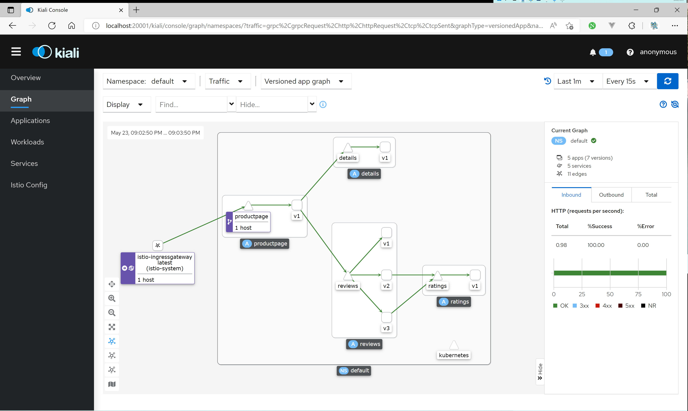

# Istio 安装步骤

> 主要参考资料：[官方文档](https://istio.io/latest/docs/setup/getting-started/)

## 下载 Istio

具体说明可见官方文档，大体步骤为：

1. 下载 Istio 的发布报

```shell
curl -L https://istio.io/downloadIstio | sh -
```

2. 添加 `istioctl` 至环境变量（方便后续调用）

## 安装 Istio

1. 安装 Istio 核心，可以选取诸多配置，如demo配置
2. 设置为某一个命名空间自动注入 Istio

```shell
istioctl install --set profile=demo -y
kubectl label namespace default istio-injection=enabled
```

## 部署示例应用

1. 应用样例的配置文件，我们可以检测一下是否能够访问其标题

```shell
kubectl apply -f samples/bookinfo/platform/kube/bookinfo.yaml
kubectl exec "$(kubectl get pod -l app=ratings -o jsonpath='{.items[0].metadata.name}')" -c ratings -- curl -s productpage:9080/productpage | grep -o "<title>.*</title>"
```

2. 配置 Istio 服务网关，即流量应该怎么流的问题

```shell
kubectl apply -f samples/bookinfo/networking/bookinfo-gateway.yaml
```

3. 使用命令行工具分析当前的 Istio 是否存在有较大的问题

```shell
istioctl analyze
```

## 访问示例应用 

我们可以通过以下命令查看 istio 的提供的外部 IP 及端口是什么：

```shell
kubectl get svc istio-ingressgateway -n istio-system
export INGRESS_HOST=$(kubectl -n istio-system get service istio-ingressgateway -o jsonpath='{.status.loadBalancer.ingress[0].ip}')
export INGRESS_PORT=$(kubectl -n istio-system get service istio-ingressgateway -o jsonpath='{.spec.ports[?(@.name=="http2")].port}')
export SECURE_INGRESS_PORT=$(kubectl -n istio-system get service istio-ingressgateway -o jsonpath='{.spec.ports[?(@.name=="https")].port}')
```

但是请注意如果 `EXERNAL_IP` 不是 IP 而是个 hostname 的话（比如 Docker Desktop 中提供的 Kubernetes ），你需要将最后的”ip“更换成”hostname“，即：

```shell
export INGRESS_HOST=$(kubectl -n istio-system get service istio-ingressgateway -o jsonpath='{.status.loadBalancer.ingress[0].hostname}')
```

如果出现 `<pending>` 等其他情况，可以见好好查询[官方文档](https://istio.io/latest/docs/setup/getting-started/#determining-the-ingress-ip-and-ports)。

确定这些端口号之后，我们就可以确定我们从外部应当去怎么访问这个示例应用了：

```shell
export GATEWAY_URL=$INGRESS_HOST:$INGRESS_PORT
echo "$GATEWAY_URL"
echo "http://$GATEWAY_URL/productpage"
```

## 开启控制面板

Istio 为我们提供图形化的控制面板，让我们可以更直观地查看其中的数据。打开的方式也很简单：

```shell
kubectl apply -f samples/addons 
kubectl rollout status deployment/kiali -n istio-system
istioctl dashboard kiali
```

就可以在浏览器中访问啦~



## 清理示例应用

示例应用中提供了一键清理的脚本，我们直接执行即可。

```shell
samples/bookinfo/platform/kube/cleanup.sh
```
