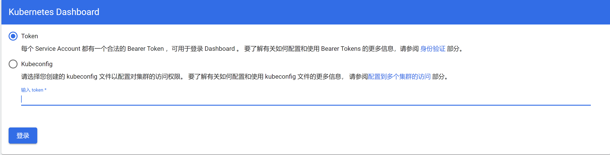
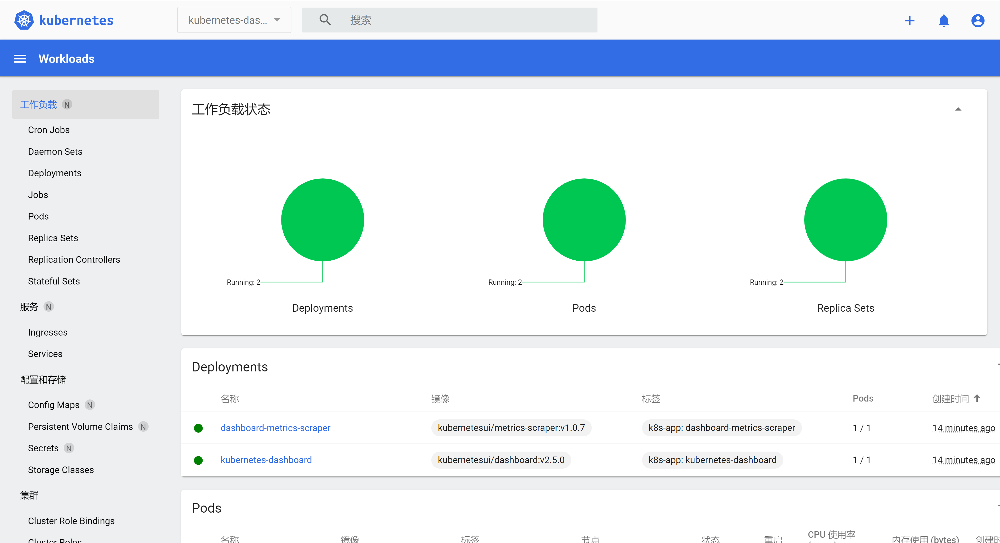

# Kubernetes 安装图形化控制面板

## 开启控制面板

我们可以很容易地在[官方文档](https://kubernetes.io/docs/tasks/access-application-cluster/web-ui-dashboard/)中找到开启控制面板的配置文件名并应用:

```
kubectl apply -f https://raw.githubusercontent.com/kubernetes/dashboard/v2.5.0/aio/deploy/recommended.yaml
```

随后我们通过 `kubectl` 提供的代理的方式访问控制面板。执行命令（该命令将占用一个终端）：

```
kubectl proxy
```

随后在浏览器中我们访问：http://localhost:8001/api/v1/namespaces/kubernetes-dashboard/services/https:kubernetes-dashboard:/proxy/，就可以看到以下界面：



## 创建访问 Token

> 看到上述页面其实我们就明白，Kubernetes 应当是想做一个鉴权，防止所有人都能看到控制面板。因此，我们必然是忽略了用户相关的操作。

### V1.24.0 之前

仔细阅读官方文档的话，可以发现创建用户的步骤，文档中也给了我们[链接](https://github.com/kubernetes/dashboard/blob/master/docs/user/access-control/creating-sample-user.md)。

根据链接中的帮助，首先我们需要准备一个 `dashboard-adminuser.yaml`，存储服务账号信息：

```yaml
apiVersion: v1
kind: ServiceAccount
metadata:
  name: admin-user
  namespace: kubernetes-dashboard
---
apiVersion: rbac.authorization.k8s.io/v1
kind: ClusterRoleBinding
metadata:
  name: admin-user
roleRef:
  apiGroup: rbac.authorization.k8s.io
  kind: ClusterRole
  name: cluster-admin
subjects:
  - kind: ServiceAccount
    name: admin-user
    namespace: kubernetes-dashboard
```

随后执行应用操作，再从应用后的内容提取出我们所需的 Token。

```shell
kubectl apply -f dashboard-adminuser.yaml
kubectl -n kubernetes-dashboard get secret $(kubectl -n kubernetes-dashboard get sa/admin-user -o jsonpath="{.secrets[0].name}") -o go-template="{{.data.token | base64decode}}"
```

### V1.24.0 之后

但是如果我们使用的是 1.24 之后的 Kubernetes，按照上述方法，虽然说我们也是能够看出 Token，但其实还是有点小问题的。毕竟不是一个特别优雅的方式x

经过网上一些搜索中，我们其实也可以在官方的[这个 Pull Request](https://github.com/kubernetes/dashboard/pull/6967) 中找到：

>In 1.24+, secret-based tokens are no longer auto-created.
>
>This updates to use the `kubectl create token` command provided instead.

虽然文档还没有更新，不过我们还是可以通过新命令来获取 Token

```shell
kubectl -n kubernetes-dashboard create token admin-user 
```

## 访问控制面板

获取 Token 并填写，我们就可以访问控制面板啦~

