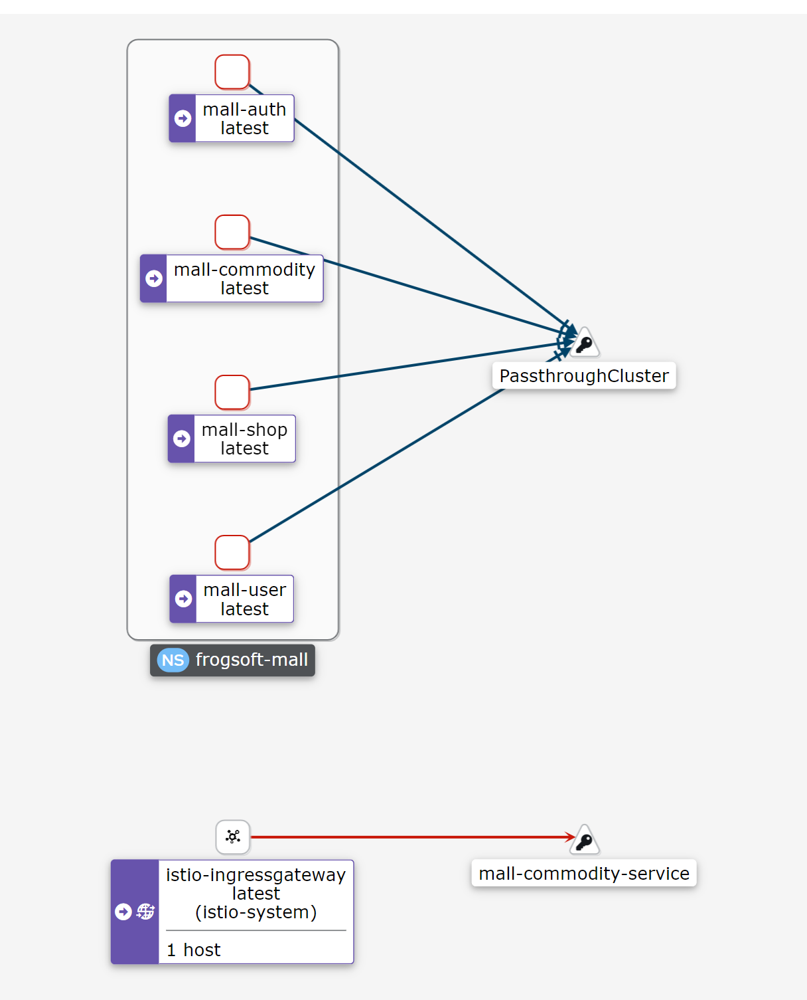
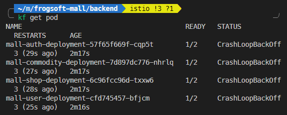
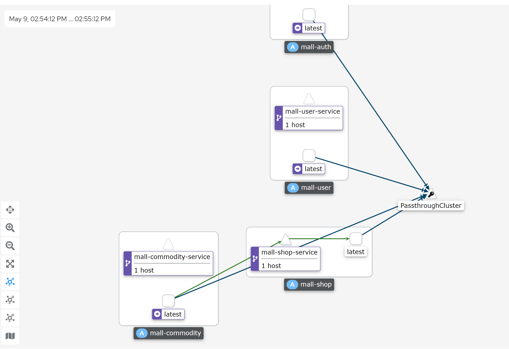

```
kubectl create ns frogsoft-mall
kubectl label namespace frogsoft-mall istio-injection=enabled
alias kf='kubectl -n frogsoft-mall'
kf apply -f samples/bookinfo/platform/kube/bookinfo.yaml

kf exec "$(kf get pod -l app=ratings -o jsonpath='{.items[0].metadata.name}')" -c ratings -- curl -s productpage:9080/productpage | grep -o "<title>.*</title>"

<title>Simple Bookstore App</title>

```


```shell
kf apply -f samples/bookinfo/networking/bookinfo-gateway.yaml
gateway.networking.istio.io/bookinfo-gateway created
virtualservice.networking.istio.io/bookinfo created
```


```shell
export INGRESS_PORT=$(kubectl -n istio-system get service istio-ingressgateway -o jsonpath='{.spec.ports[?(@.name=="http2")].port}')
export SECURE_INGRESS_PORT=$(kubectl -n istio-system get service istio-ingressgateway -o jsonpath='{.spec.ports[?(@.name=="https")].port}')
export INGRESS_HOST=127.0.0.1
export GATEWAY_URL=$INGRESS_HOST:$INGRESS_PORT
curl http://${GATEWAY_URL}/productpage
```


```yaml
apiVersion: apps/v1
kind: Deployment
metadata:
  name: mall-auth-deployment
  namespace: frogsoft-mall
  labels:
    app: mall-auth
spec:
  selector:
    matchLabels:
      app: mall-auth
  template:
    metadata:
      labels:
        app: mall-auth
    spec:
      containers:
        - name: mall-auth
          image: frogsoftware/mall-auth:0.0.1
          ports:
            - containerPort: 9000

---

apiVersion: v1
kind: Service
metadata:
  name: mall-auth-service
  namespace: frogsoft-mall
  labels:
    app: mall-auth
spec:
  ports:
    - port: 9000
    - targetPort: 9000
  selector:
    app: mall-auth
  type: NodePort

```


```shell
error validating data: [ValidationError(Service.spec.ports[1]): missing required field "port" in io.k8s.api.core.v1.ServicePort, ValidationError(Service.spec.ports[2]): missing required field "port" in io.k8s.api.core.v1.ServicePort]; if you choose to ignore these errors, turn validation off with --validate=false
```


http://localhost/commodities/test/getShop/1


```
upstream connect error or disconnect/reset before headers. reset reason: connection failure
```


node name





 CrashLoopBackOff 




环境变量设置的有问题！！





代码见

https://github.com/frog-software/frogsoft-mall/tree/develop-backend-nickbit/backend

