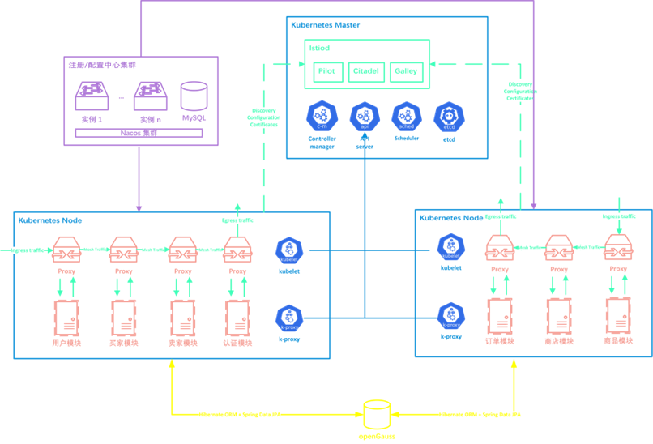
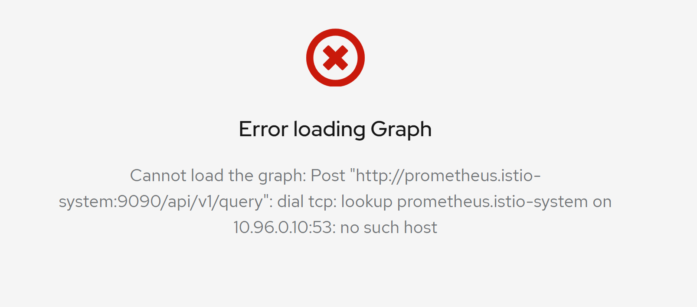
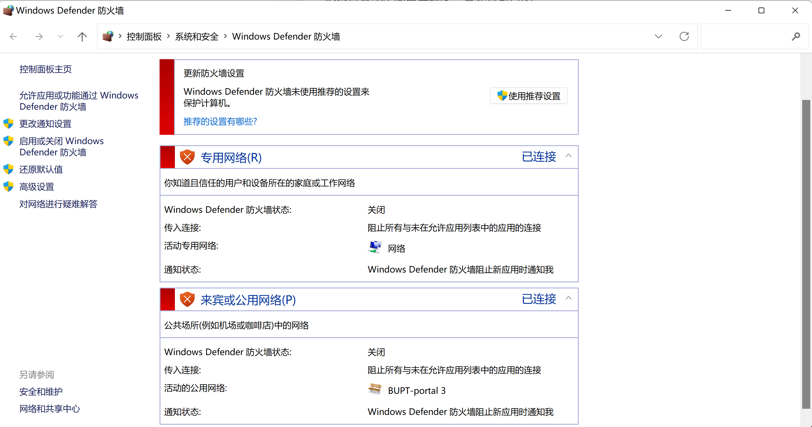
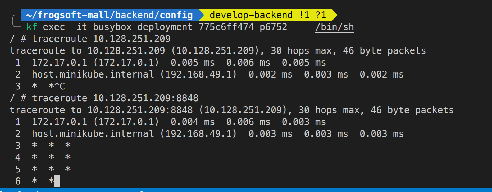
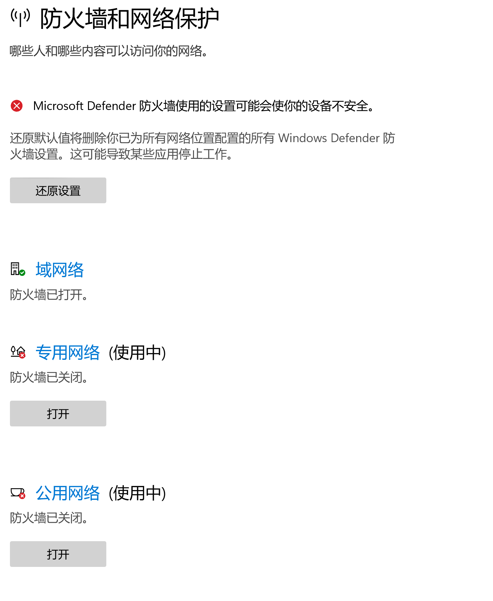
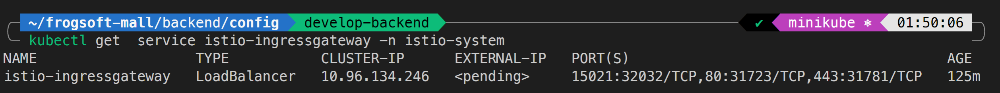
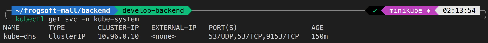

# 小记20220523防火墙问题

## 问题症状

利用之前编写的脚本（之前能够正常运行）开始运行 istio 环境，未料到竟然遇到启动失败。通过查看 log 寻找原因：（之前运行过 `alias kf='kubectl -n frogsoft-mall' `）

```shell
kf logs mall-user-deployment-5696f5849f-hhnk8
```

这里选取其中的核心部分：


```
java.util.concurrent.ExecutionException: com.alibaba.nacos.shaded.io.grpc.StatusRuntimeException: UNAVAILABLE: io exception
……
2022-05-23 09:26:04.291  INFO 1 --- [           main] com.alibaba.nacos.common.remote.client   : [967135f1-bd83-41b3-bdc8-2cc267a447e5_config-0] Try to connect to server on start up, server: {serverIp = '172.21.113.232', server main port = 8848}
2022-05-23 09:26:08.880 ERROR 1 --- [           main] c.a.n.c.remote.client.grpc.GrpcClient    : Server check fail, please check server 172.21.113.232 ,port 9848 is available , error ={}
```

`172.21.113.232` 其实是本地 IP，报错大致说的是无法连接到该地址的 `9848` 端口。

可能需要介绍一下当前采取的方案，对于微服务的各个模块目前是是直接部署在 Kubernetes 里的，但是 `注册/配置中心` 以及 `openGauss` 数据库是利用 `docker` 外挂的，使用 IP 地址进行访问。（`docker` 将这些服务映射到本机的各个对应端口，但是 Istio 网关只接管了 `80` 端口）



现在说明至少 `9848` 这个端口没有成功的访问上，那 `nacos` 中的基本页面 `8848` 能够访问嘛？

```shell
kf exec mall-user-deployment-5696f5849f-hhnk8 -- curl 172.21.113.232:8848/nacos -v
……
> GET /nacos HTTP/1.1
> Host: 172.21.113.232:8848
> User-Agent: curl/7.74.0
> Accept: */*
> 
* Recv failure: Connection reset by peer
```

同样是被拒绝。

## 尝试解决

### 是否是内部节点无法访问外部主机的问题？

通过以上现象，自然的我们会猜想：在这些内部节点里面是不是无法访问外部主机的内容？我们是否应当利用 `istio` 的外部网关进行调整？

资料显示，默认情况下其实 Istio 反而是不限制访问外部请求的。我们检查一下是否如此？

```shell
kubectl get istiooperator installed-state -n istio-system -o jsonpath='{.spec.meshConfig.outboundTrafficPolicy.mode}'
```

结果是没有任何输出（资料显示，没有输出就是默认为`ALLOW_ANY`）。

如果不放心的话，我们强制让他显式说明，执行命令：

```
istioctl install --set meshConfig.outboundTrafficPolicy.mode=ALLOW_ANY  
```

此时再检查输出，果然出现了 `ALLOW_ANY` 字样。再试尝试是否能够启动我们的蛙软商城，很可惜，失败了。

有没有一种可能，其实只是访问不了我们需要的 `nacos` 服务，但是其他外网是能够正常访问的？我们检查是否能访问百度服务（在 `pod` 内 `curl www.baidu.com`），发现其实是可以的。

通过以上尝试，我们知道这个问题至少不是出口流量的问题，就是 找不到 `nacos` 对应的网络的问题。 

### 是否是 Kubernetes 的 DNS 的问题？

使用 Istio 图形化面板的过程中，出现了一个额外的报错信息，大致是找不到 `10.96.0.10:53` 。但是这个地址十分特殊，因为我本身没有任何的印象，也没有在本地找到相关的网段。



在网上搜索到相关 [Issue](https://github.com/istio/istio/issues/26354) ，告知我们  `10.96.0.10:53` 是 Kubernetes 的默认 DNS 服务器。那是不是因为连接不到 DNS 服务器所以导致无法连接？（但是实际上 通过 IP 来访问的话，和 DNS 本身应该是没有关系的，更可能是路由的过程中被阻断了）

但死马当活马医，先重装了再说。在搜索资料的过程中，也有显示这个 DNS 服务器连接不上可能和虚拟机方式安装有关系（可能需要一些额外的操作），哪怕我觉得我的 `docker desktop` 里的 Kubernetes 应该没有关系，但是为了以防万一选择重装环境。

重装 Kubernetes 之后，修复了这个报错，但是仍然没有成功启动蛙软商城的全部服务。

### 是否防火墙问题？

既然 Istio 并没有限制外网访问问题，也不是 Kubernetes 出了问题，是不是本机的网络政策阻断了 IP 请求呢？

在**控制面板**中关闭防火墙的相关设置。

> 为什么特地强调是控制面板呢？因为这是一个坑……



再次尝试，仍然无法成功运行蛙软商城的相关服务。

## 对照试验

光靠自己可能很难解决问题，使用其他的主机进行对照试验。

同样的仓库，在另一台主机上成功运行，说明不是配置出现问题。

为控制变量，我也将运行环境更改为相同的 `minikube` ，但仍然无法成功运行。

这可以说明一定是我本机出现了一些偏差。

## 解决问题

使用 `busybox` 里的 `traceroute` 指令，检测路由访问情况：



可以发现在走到 `minikube` 之后就找不到路由的下一跳了，根本走不到本机。

再检查一下是不是 WSL2 里的防火墙问题？但是实际上 WSL2 里并没有防火墙。

那说明应该还是 Windows 11 的防火墙问题。

但是明明在控制面板里关过防火墙呀？不过既然是 Windows11，那就试一试 `设置` 里的防火墙：



好家伙，怎么还有一个 `域网络` 的防火墙？虽然没有使用中的标识，但是大胆猜测和这个东西有关。（根据贫瘠的计算机网络知识，这些东西肯定不是在一个域）

将其关闭，重新运行启动脚本，蛙软商城成功运行了。

> 所以为什么两周之前可以跑，两周之后不能跑？难道是 Windows11 升级的问题？

不过还有一些遗留的小问题，比如访问 API 的时候还是没反应。虽然可以根据此前的相同命令获取到 `IP`、 `port`之类的信息，但估计和这个 `External IP` 是`<pending>` 还是有关系的。



查阅网上资料，需要预先调用 `minikube tunnel` 进行流量代理，执行后果然能够正常运行。

接口其实是可以正常访问的，用 Istio 查看图形化界面的时候出现了熟悉的老错误：


使用命令查看 DNS 服务器的地址：

```shell
kubectl get svc -n kube-system
```



其实是一致的，但是为什么会报这样的错误呢？（暂时还不太理解，有无评论区用户指点一下）不过解决的时候，使劲滚动刷新几下，（莫名其妙地）折腾好了。

