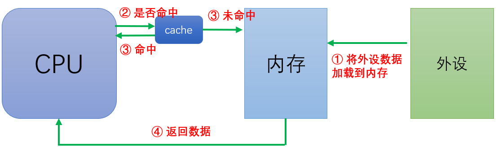
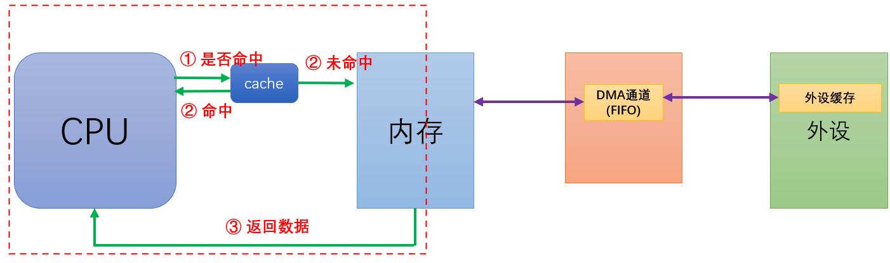
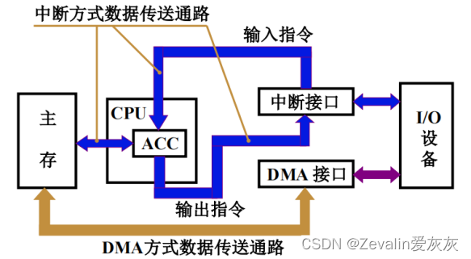
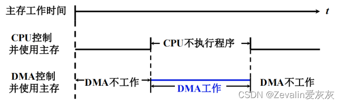
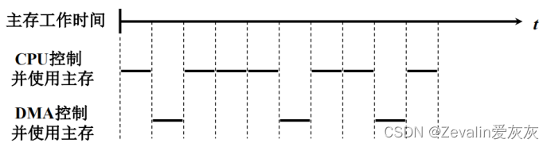
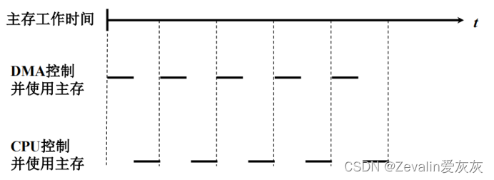
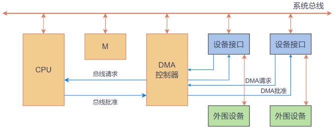
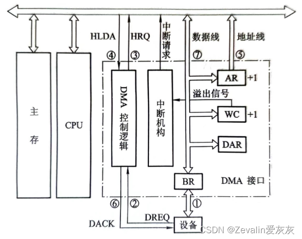
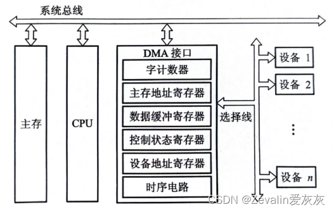
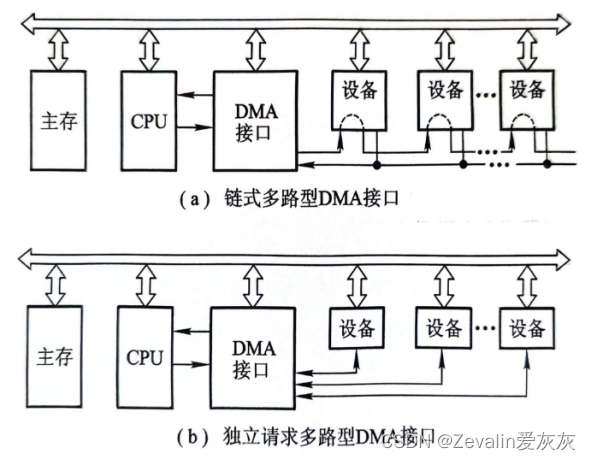

## 浅谈DMA

### DMA 的产生

#### CPU 读写数据

传统CPU 获取数据的步骤如下：

1. CPU 将外设数据加载到内存（和CPU的处理速度最接近）
2. CPU 检查 cache 是否有自己需要的数据（是否命中）
3. 如果命中，直接返回数据；如未命中，继续从内存获取（这里暂时不考虑MMU）
4. 返回数据

> CPU 不能直接从外设获取或者向外设写入内容的原因：
> 
> - CPU 的工作速度和外设的工作速度差距太大
> - 外设格式种类繁多，无法直接存取，需要经过转换

#### 专业团队专职读写

由上面 CPU 读取数据来看，无论是将外设数据搬移到内存，还是从内存读取数据，都需要CPU的参与。

因此可以把比较固定的任务（如数据的搬运）让别的模块（即DMA）来做，可以减轻CPU负担，提高系统的效率。

DMA（Direct Memory Access）即直接存储器访问，借助内部的控制器来实现内存和外设之间的数据传输。有了DMA，CPU 可以专注于内存数据的存取，数据的搬运过程完全可以交由DMA硬件完成，能够提高系统的吞吐率（IO 效率）。

有了DMA以后，不代表完全不需要CPU了，只是不会像中断那样频繁向CPU发送请求。

- 开始传输时刻：DMA向CPU申请至少一个总线周期的占用时间来做数据传输工作
- 结束传输时刻：DMA向CPU发送中断请求，请求CPU处理这些数据

此外由于内存和设备交换信息时是不需要通过CPU的，CPU也不需要暂停现行程序为设备服务，省去了保护现场和恢复现场的工作，工作速度比程序中断方式要快不少。

### 总线控制争夺

虽然使用DMA方式传输数据不需要通过CPU，但是总线只有一条，CPU和DMA不能同时控制总线。

> 申请并掌握总线控制权的一方称为 “主设备”，另一方则被称为“从设备”。
>
> 注意：区别主设备与从设备身份差异的基本依据在于谁申请并掌握总线控制权，并不在于谁发送数据、谁接收数据，主设备可以发送数据也可以接收数据。反之，从设备也一样。

#### 停止CPU访存

当外设要求传送一批数据时，由DMA接口向CPU发一个停止信号，要求CPU放弃地址线、数据线和有关控制线的使用权，DMA接口获得总线控制权后开始进行数据传送，在数据传送结束后DMA接口通知CPU可以使用主存，并把总线控制权交回给CPU。

这种方式的优点是控制简单，适用于数据传输率很高的I/O设备实现成组数据的传送；缺点是DMA接口在访问主存时，CPU基本上处于不工作状态或保持原状态，而且即使I/O设备高速运行，两个数据之间的准备间隔也总大于一个存取周期，因此CPU对主存的利用率并没得到充分发挥。

#### 周期挪用（或周期窃取）

每当I/O设备发出DMA请求时，I/O设备便挪用或窃取总线占用权一个或几个存取周期，而DMA不请求时，CPU仍继续访问主存。

I/O设备请求DMA传送会遇到三种情况：

1. CPU此时不需要访存（比如CPU正在执行耗时较长的乘法指令），I/O设备与CPU不发生冲突。
2. I/O设备请求DMA传送时，CPU正在访问主存，此时必须待存取周期结束，CPU才能将总线占有权让出。
3. I/O设备要求访问主存时，CPU也要求访问主存，二者产生访问冲突，此时I/O访存优先于CPU访存，因为I/O不立即访问主存就可能会丢失数据，这时I/O要窃取一两个存取周期，意味着CPU在执行访问主存指令过程中插入了DMA请求，并挪用了一两个存取周期，使CPU延缓了一两个存取周期再访问主存。

#### DMA与CPU交替访问

​        这种方法适合于CPU的工作周期比主存存取周期长的情况，CPU的工作周期可分为两个分周期，其中一个周期专供DMA访存，另一个周期专供CPU访存，CPU本身也不会停止主程序的运行，不会进入等待状态。

​        这种方式不需要总线使用全的申请、建立和归还过程，总线使用权是通过两个分周期分别控制的。

### DMA基本流程

#### 任务准备

CPU 会对 DMA 控制器和 IO 接口进行初始化，初始化的内容如下：

- 配置 DMA 内存缓冲区的首地址（即告诉DMA把数据放到哪）
- 配置 DMA 传输方向（是向外设传数据，还是从外设读数据）
- 配置 DMA 交换量（设置数据传输的上限）
- 指定 DMA 的交换外设，并初始化 I/O 设备的寻址信息

#### 请求审批

##### 设备接口 => DMA 控制器：DMA请求（DRQ）

> DRQ = DMA Request

设备接口向DMA控制器发送 “DMA请求” ，即请求使用 DMA 进行数据传输

##### DMA 控制器 => CPU：总线请求（HRQ）

> HRQ = Hold Request

DMA 控制器向CPU申请 “总线占用”，DMA控制器和 CPU 只能有一个占用总线

##### CPU => DMA 控制器：总线批准（HLDA）

> HLDA = Hold Acknowledgment

CPU 批准使用总线，此时 CPU 会让出一个或者多个总线周期用于数据传输。

在DMA数据传输期间，CPU 停止访问内存，无法执行需要占用总线的指令。

##### DMA 控制器 => 设备接口：DMA批准（DACK）

> DACK = DMA Acknowledgment

DMA 批准设备请求，此时 DMA 控制器将掌握总线控制权。CPU 和 DMA 如何争夺总线的控制权详见后文。

#### 数据传送

数据传送期间，DMA 控制器会向总线发送读/写命令、向 I/O 接口发响应信号。真正的数据交互是内存和设备接口，DMA 控制器只是负责控制整个数据传送流程。

##### 工作模式

① 直接模式

DMA 直接进行从源地址到目的地址的数据传输。

② FIFO 模式

FIFO模式下，可以将要传输的多个数据（或字节）累计存储在FIFO缓冲器中，然后在FIFO缓冲器中设置存储阈值，当到达阈值时，FIFO会自动把所有存储的数据一次性的发送到目标地址。

##### 数据传输方式

① 单字传送（单次模式）

DMA 请求获得批准后，CPU 让出一个总线周期用于字或字节的传送。结束后， DMA 控制器归还总线控制权，CPU 再重新判断下一个总线周期的总线控制权是 CPU 保留，还是继续响应一次新的 DMA 请求。这种方式称为单字传送方式，又称为周期挪用或周期窃取。

② 块传送（突发模式）

DMA 请求获得批准后，DMA 控制器掌管总线控制权，连续占用若干个总线周期，进行成组连续的批量传送，直到批量传送结束，才将总线的控制权交还给 CPU。这种方式称为成组连续传送方式

##### 寻址模式

① 增量寻址：发送完数据后，继续发送下一个地址的数据，配合突发传输模式

② 非增量寻址: 一发送完数据后，如果想要继续发送数据，需要根据软件配置的发送下一个数据的地址，再进行数据的传输

#### 善后处理

在初始化时，CPU 便指定了DMA的交换量，而且DMA 控制器内部有一个计数器，只有 DMA 控制器知道传送是否结束。当传送结束时，DMA控制器向CPU发送一个传输完成的中断，CPU重新接管总线的控制权。

> DMA 控制器并非只有在传输完成时才会发送中断，其实传输过半、传输错误也可以发送中断

### DMA的功能与组成

#### DMA 功能

根据以上流程可以归纳出 DMA 的核心功能：

1. 向CPU申请DMA传送。
2. 在CPU允许DMA工作时，处理总线控制权的转交，避免因进入DMA工作而影响CPU正常活动或引起总线竞争。
3. 在DMA期间管理系统总线，控制数据传送。
4. 确定数据传送的起始地址和数据长度，修正数据传送过程中的数据地址和数据长度。
5. 在数据块传送结束时，给出DMA操作完成的信号。

#### DMA 组成（硬件原生）

##### 主存地址寄存器（AR）

AR用于存放主存中需要交换数据的地址。

在DMA传送数据前，必须通过程序将数据在主存中的首地址送到主存地址寄存器；在DMA传送过程中，每交换一次数据，将地址寄存器的内容加1，直到一批数据传送完毕为止。

##### 字计数器（WC）

WC用于记录传送数据的总字数，通常以交换字数的补码值预置。

在DMA传送过程中，每传送一个字，字计数器加1，直到计数器为0，即最高位产生进位时，表示该批数据传送完毕（若交换字数以原码值预置，则每传送一个字，字计数器减1，直到计数器为0时，表示该批数据传送结束），DMA接口随即向CPU发中断请求信号。

##### 数据缓冲寄存器（BR）

BR用于暂存每次传送的数据。

通常DMA接口与主存之间采用字传送，而DMA与设备之间可能是字节或位传送，因此DMA接口中还可能包括有装配或拆卸字信息的硬件逻辑，如数据移位缓冲寄存器、字节计数器等。

##### DMA控制逻辑

DMA控制逻辑负责管理DMA的传送过程，由控制电路、时序电路及命令状态控制寄存器等组成。

每当设备准备好一个数据字（或一个字传送结束），就向DMA接口提出申请（DERQ），DMA控制逻辑便向CPU请求DMA服务，发出总线使用权的请求信号（HRQ），待收到CPU发出的响应信号HLDA后，DMA控制逻辑便开始管理DMA传送的全过程，包括对主存寄存器和字计数器的修改、识别总线地址、指定传送类型（输入或输出）以及通知设备已经被授予一个DMA周期（DACK）等。

##### 中断机构

字计数器溢出（全“0”）时，表示一批数据交换完毕，由“溢出信号”通过中断机构向CPU提出中断请求，请求CPU作DMA操作后的处理。

> 这里的中断不是为了传送数据，只是为了报告一批数据传送结束。

##### 设备地址寄存器（DAR）

DAR存放I/O设备的设备码或表示设备信息存储区的寻址信息，如磁盘数据所在的区号、盘面号和柱面号，具体内容取决于设备的数据格式和地址的编址方式。

#### DMA 具体流程

> 以周期挪用的DMA方式为例，将前文粗略概括的流程进一步细化，具体到DMA内部的逻辑组件的操作。

##### 初始化

在DMA接口开始工作之前，CPU必须对其进行配置相关信息：

1. 给DMA控制逻辑指明数据传送方向是输入（写主存）还是输出（读主存）。
2. 向DMA设备地址寄存器送入设备号，并启动设备。
3. 向DMA主存地址寄存器送入交换数据的主存起始地址。
4. 对字计数器赋予交换数据的个数。

##### 输入流程

数据输入的具体过程如下：
1. 当设备准备好一个字时，发出选通信号，将该字读到DMA的数据缓冲寄存器中，表示数据缓冲寄存器“满”。
2. 数据缓冲寄存器“满”的同时设备向DMA接口发送请求（DERQ）。
3. DMA接口向CPU申请总线控制权（HRQ）。
4. CPU发回HLDA信号，表示允许将总线控制权交给交给DMA接口。
5. 将DMA主存地址寄存器中的主存地址送地址总线，并命令存储器写。
6. 通知设备已被授予一个DMA周期（DACK），并为交换下一个字节做准备。
7. 将DMA数据缓冲寄存器的内容送数据总线。
8. 主存将数据总线上的信息写至地址总线指定的存储单元中。
9. 修改主存地址和字计数值。
10. 判断数据块是否传送结束，若未结束就继续传送，若已结束（字计数器溢出）则向CPU申请程序中断，标志数据块传送结束。
    
##### 输出流程

数据输出的具体过程如下：

1. 当DMA数据缓冲寄存器已将输出数据送至I/O设备后，表示数据缓冲寄存器已“空”。
2. 设备向DMA接口发请求（DREQ）。
3. DMA接口向CPU申请总线控制权（HRQ）。
4. CPU发回HLDA信号，表示允许将总线控制权交给DMA接口使用。
5. 将DMA主存地址寄存器中的主存地址送地址总线，并命令存储器读。
6. 通知设备已被授予一个DMA周期（DACK），并为交换下一个字做准备。
7. 主存将相应地址单元的内容通过数据总线读入DMA的数据缓冲寄存器中。
8. 将DMA数据缓冲寄存器的内容送到输出设备，若为字符设备则需将其拆成字符输出。
9. 修改主存地址和字计数值。
10. 判断数据块是否传送完毕，若未完毕就继续传送，若已传送完毕（字计数器溢出）则向CPU申请程序中断，标志数据块传送结束。

#### DMA 类型

##### 选择型DMA接口

选择性DMA接口特别适用于数据传输率很高的设备。

选择型DMA接口的主要特点是在物理上可连接多个设备，在逻辑上只允许连接一个设备，即在某一段时间内DMA接口只能为一个设备服务，关键是在预处理时将所选设备的设备号送入设备地址寄存器。

##### 多路型DMA接口

多路型DMA接口特别适用于同时为多个数据传输率不高的设备服务。

多路型DMA接口不仅在物理上可以连接多个设备，而且在逻辑上也允许多个设备同时工作，各个设备采用字节交叉的方式通过DMA接口进行数据传送，每个与DMA接口连接的设备都设置有一套寄存器分别存放各自的传送参数。

### 参考

- https://blog.csdn.net/challenglistic/article/details/132109276
- https://blog.csdn.net/Zevalin/article/details/136753317