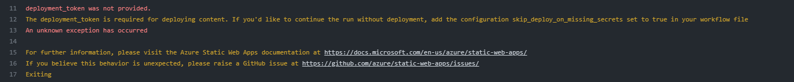

## 安全 Actions —— 以 Azure Static Web Apps 为例

### 背景介绍

首先我们或许需要知道 `Azure Static Web Apps` 是个什么？最直接的概念显然可以查看它的[官网](https://azure.microsoft.com/zh-cn/products/app-service/static/)。可以看到，它能够免费部署静态页面，并且特性中有一条“无缝过渡环境”，小字部分写着“基于拉取请求生成应用的暂存版本，以在发布前预览更改”。而我的需求正是如此。

在前端开发过程中，我们通常会使用 `Pull Request`（即所谓`拉取请求`，一般简写为 `PR`）进行代码审查。对于前段而言，除了直接查看代码以外，整体的页面呈现效果也是十分重要的一环。但是，切换到每个 `PR` 编译后查看页面十分不便。因而我们可以使用 `Azure Static Web Apps` 来自动化部署。

注：免费版本可以同时部署三个拉取请求对应的前端页面。

### 常规做法

上述背景似乎和标题“安全 Actions”没有什么关系？打开 GitHub 关于部署该服务的[文档](https://docs.github.com/en/actions/deployment/deploying-to-your-cloud-provider/deploying-to-azure/deploying-to-azure-static-web-app)甚至直接给出了 `workflow` 的内容：

```yaml
# This workflow uses actions that are not certified by GitHub.
# They are provided by a third-party and are governed by
# separate terms of service, privacy policy, and support
# documentation.

# GitHub recommends pinning actions to a commit SHA.
# To get a newer version, you will need to update the SHA.
# You can also reference a tag or branch, but the action may change without warning.

name: Deploy web app to Azure Static Web Apps

env:
  APP_LOCATION: "/" # location of your client code
  API_LOCATION: "api" # location of your api source code - optional
  APP_ARTIFACT_LOCATION: "build" # location of client code build output

on:
  push:
    branches:
      - main
  pull_request:
    types: [opened, synchronize, reopened, closed]
    branches:
      - main

permissions:
  issues: write
  contents: read

jobs:
  build_and_deploy:
    if: github.event_name == 'push' || (github.event_name == 'pull_request' && github.event.action != 'closed')
    runs-on: ubuntu-latest
    name: Build and Deploy
    steps:
      - uses: actions/checkout@v3
        with:
          submodules: true
      - name: Build And Deploy
        uses: Azure/static-web-apps-deploy@1a947af9992250f3bc2e68ad0754c0b0c11566c9
        with:
          azure_static_web_apps_api_token: ${{ secrets.AZURE_STATIC_WEB_APPS_API_TOKEN }}
          repo_token: ${{ secrets.GITHUB_TOKEN }}
          action: "upload"
          app_location: ${{ env.APP_LOCATION }}
          api_location: ${{ env.API_LOCATION }}
          app_artifact_location: ${{ env.APP_ARTIFACT_LOCATION }}

  close:
    if: github.event_name == 'pull_request' && github.event.action == 'closed'
    runs-on: ubuntu-latest
    name: Close
    steps:
      - name: Close
        uses: Azure/static-web-apps-deploy@1a947af9992250f3bc2e68ad0754c0b0c11566c9
        with:
          azure_static_web_apps_api_token: ${{ secrets.AZURE_STATIC_WEB_APPS_API_TOKEN }}
          action: "close"
```

我们把以上内容保存在仓库中。在主分支中，执行十分正常；但是在 PR 中，CI 执行的结果是：



`deployment_token was not provided.` ? 这就十分奇怪了，可以看到在上方 `YAML` 文件的第 42 行明明已经传入了。查看了很多关于 `token` 权限的[文档](https://docs.github.com/en/actions/security-guides/automatic-token-authentication)并进行尝试，没有得到有效反馈。换个角度：主分支中它都能够正常的执行，说明这一定是 `Pull Request` 的机制问题。

### 问题根源

其实在 GitHub Security Lab 的文章 [*Keeping your GitHub Actions and workflows secure Part 1: Preventing pwn requests*](https://securitylab.github.com/research/github-actions-preventing-pwn-requests/) 中很详细地阐述了这件事。或者说，它的标题就讲了这种机制的目的：“预防 pwn 请求”。

一个很浅显的例子：假如我有一个很重要的密钥，我将 CI 的内容改为输出密钥，那这个密钥是不是就会被输出呢？如果没有预防措施的话，确实是这样的。因此，GitHub 在普通的 Pull Request 中禁止了一系列需要权限的操作。

作为替代性措施，GitHub 引入了 `pull_request_target` 这个触发事件（trigger），它和此前的 `pull_request` 又有什么区别呢？它永远执行**安全**的代码。那什么叫安全的代码？其实就是经过仓库所有者认证过的那些代码。

似乎说了一堆有的没的信息？它执行起来是什么效果呢？那就是在 `pull_request_target` 触发的事件中，如果你要获得仓库代码（checkout），你检出的会是基分支的代码（也就是这次 Pull Request 修改之前的分支代码）！

> 换句话说，哪怕你在本次 PR 中把 CI 的内容改为了输出密钥，但是 GitHub 实际执行的 CI 仍然是此次修改之前的正常 CI。

### 解决方案

找到问题所在，自然应当解决问题。可是直接使用 `pull_request_target` ，它跑的代码是基代码，那我这个自动部署静态页面的功能岂不是没有用了？

我们可以借鉴前文提到的[文章]((https://securitylab.github.com/research/github-actions-preventing-pwn-requests/) )，通过拆分“接收”和“执行”来解决。在文章中给了一个例子，在”接收“里获取 PR 编号，在”执行“里将这个 PR 编号输出在评论里。 这种做法有一个前提：你需要保证“执行”的内容是安全的，要不然一样失去意义。

不过这个例子、场景都非常适合我们的初心：根据 PR 部署 Azure 静态页面。具体来说，我们在“接收”中编译前端代码，在”执行“中将编译后的结果部署到 Azure 静态页面上，最后把部署后的网址发在评论区中。因为是我们自己指定的“接收”，并且执行的也只是前端代码，所以相对来说这个“执行”还是比较安全的。

我在这个[仓库](https://github.com/e-dialect/hinghwa-dict-uni-app/tree/master/.github/workflows)中部署了一波，也把代码贴在下方：

“接收” `receive.yaml` ：

```yaml
name: Receive PR
on:
  pull_request:
    types:
      - opened
      - synchronize
      - reopened

jobs:
  test-build:
    runs-on: ubuntu-latest
    steps:
      - uses: actions/checkout@v3
      - uses: actions/setup-node@v3
        with:
          node-version: "16.x"
          cache: "yarn"
      - name: Install Dependencies
        run: |
          yarn install --frozen-lockfile --production=false
      - name: Lint
        run: |
          yarn run lint
      - name: Build Your Frontend
        run: |
          yarn run build

      - name: Save PR number
        run: |
          mkdir -p ./pr
          echo ${{ github.event.number }} > ./pr/NR

      - uses: actions/upload-artifact@v3
        with:
          name: pr
          path: |
            ./pr/NR
            ./dist/build/h5
```

“执行” `deployment.yaml`：

```yaml
name: Deployment
# read-write repo token
# access to secrets
on:
  workflow_run:
    workflows: [ "Receive PR" ]
    types:
      - completed

jobs:
  upload:
    runs-on: ubuntu-latest
    if: >
      github.event.workflow_run.event == 'pull_request' &&
      github.event.workflow_run.conclusion == 'success'
    steps:
      - name: "Download artifact"
        uses: actions/github-script@v3.1.0
        with:
          script: |
            var artifacts = await github.actions.listWorkflowRunArtifacts({
               owner: context.repo.owner,
               repo: context.repo.repo,
               run_id: ${{github.event.workflow_run.id }},
            });
            var matchArtifact = artifacts.data.artifacts.filter((artifact) => {
              return artifact.name == "pr"
            })[0];
            var download = await github.actions.downloadArtifact({
               owner: context.repo.owner,
               repo: context.repo.repo,
               artifact_id: matchArtifact.id,
               archive_format: 'zip',
            });
            var fs = require('fs');
            fs.writeFileSync('${{github.workspace}}/pr.zip', Buffer.from(download.data));
      - run: unzip pr.zip

      - name: "Save PR number to env.number"
        run: echo "number=$(cat ./pr/NR)" >> $GITHUB_ENV

      - name: Build And Deploy
        id: builddeploy
        uses: Azure/static-web-apps-deploy@v1
        with:
          azure_static_web_apps_api_token: ${{ secrets.AZURE_STATIC_WEB_APPS_API_TOKEN_ORANGE_CLIFF_0B1E10000 }}
          repo_token: ${{ secrets.GITHUB_TOKEN }} # Used for Github integrations (i.e. PR comments)
          action: "upload"
          ###### Repository/Build Configurations - These values can be configured to match your app requirements. ######
          # For more information regarding Static Web App workflow configurations, please visit: https://aka.ms/swaworkflowconfig
          app_location: "path/to/code" # App source code path
          output_location: "path/to/output" # Built app content directory - optional
          deployment_environment: ${{ env.number }}
          ###### End of Repository/Build Configurations ######

      - name: Comment URL on PR
        uses: actions/github-script@v3
        with:
          github-token: ${{ secrets.GITHUB_TOKEN }}
          script: |
            var fs = require('fs');
            var issue_number = Number(fs.readFileSync('./pr/NR'));
            await github.issues.createComment({
              owner: context.repo.owner,
              repo: context.repo.repo,
              issue_number: issue_number,
              body: 'This PR is deployed at ${{ steps.builddeploy.outputs.static_web_app_url }}'
            });
```
