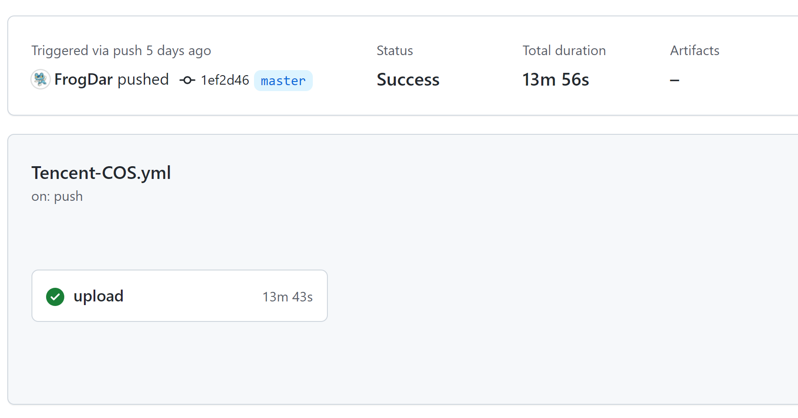

# 腾讯云增量传输

## 背景条件

原本塔居人这个博客（静态博客）是部署在云主机上面的，后来改成了腾讯云的对象存储。其实理论上来说，用 GitHub Pages 更为方便，只是考虑到国内普通用户的访问情况，因此还是通过对象存储来访问。

既然博客本身都通过 GitHub 进行管理，那为何不使用起方便又快捷地 GitHub Actions 呢？于是乎，我们有了最初版本的传输方案：“编译静态网页-上传至腾讯云存储桶”。

从理论角度来说，这么做没有任何问题。只是因为一些众所周知的原因，这样的传输速度实在是太慢了，慢到什么程度呢？在现在这个规模（13篇博客）下，传输一次可能需要7-15分钟，甚至还有一些时候直接 “SSL连接中断”。



因此，优化[博客仓库](https://github.com/FrogDar/tajuren)的 CI 迫在眉睫。

## 实现思路

既然已知瓶颈在于传输速度很慢，那么显然我们应该去减少传输量。

当前的方案将 Hugo 编译出的所有网页全部传输至存储桶中，那么就有一个最为朴素的优化思路：每次更新博客的时候，大部分的文章及页面是没有改动的，因此我们仅需传输发生变化过的文件。

如果将思路细化的话，我们大致可以写成：

1. 编译 Hugo
2. 找出上次传输的文件情况
3. 遍历本次的每个文件，若和上次相同则忽略该文件的传输

那么这时候，就需要考虑，如何在工程上，准确来说是 CI 中实现这个思路呢？（伪代码很容易写，但是如何将它“翻译”成可接受的一种方案呢？）这或许就要考验我们的综合工程能力。

## 实现方案

### 技术选型

既然这个东西会跑在 GitHub Actions 里，那我们首先应该考虑脚本型语言，或者说排除编译型语言。因为在这种环境中，编译就像个黑盒子，你完全不知道他在背后做了什么，CI 也没办法及时地给出反馈。

因此，**尽可能使用命令行工具**应当是我们要坚持的原则。

在这种思想下，如何比较两个文件上是否相同呢？完全可以用文件**哈希值**来判断。（这又是一个可以直接命令行的做法）

那么比较差异呢？`shell` 脚本欢迎你！

### CI 步骤

> 完整代码可见[仓库](https://github.com/FrogDar/tajuren/blob/master/.github/workflows/cos-diff.yml)

#### 编译静态文件

由于我们的博客引入了其他人的主题，因此在获取代码的时候要注意添加 `submodules` 。执行这三个步骤后，我们所需要的 HTML 文件就会产生在 `public` 文件夹下啦~

```yaml
- uses: actions/checkout@v3
  with:
    submodules: true

- name: Setup Hugo
  uses: peaceiris/actions-hugo@v2
  with:
    hugo-version: '0.91.2'

- name: Build Hugo
  run: hugo --minify
```

#### 文件哈希值

不知道大家第一反应会是怎么来计算每一个文件的哈希值呢？只知道如果用 `find` 命令，还是非常方便的。对于 `public` 下的每个文件都执行 `sha256sum` 命令，并将结果输出到 `public/sha256sum.txt` 中。

```yaml
- name: Calculate SHA256
  run: find public -type f -exec sha256sum {} \; > public/sha256sum.txt
```

#### 比较差异

之前版本的 `sha256sum.txt` 会在之前被上传，我们直接把它下载下来就相当于获取上次的文件情况。

同时我们手工编写了一个脚本 `incremental-diff.sh` ，这个脚本能够删除所有无需上传（重复）的文件。（具体如何实现的，后文展开）

```yaml
- name: Download Previous SHA256
  run: curl -fsSl https://tajuren.cn/sha256sum.txt -o sha256sum.txt || touch sha256sum.txt

- name: Calculate Diff and Minimize Upload Size
  run: "[ -f sha256sum.txt ] && ./incremental-diff.sh"
```

#### 上传至存储桶

将腾讯云相关的密钥提前写入仓库的密钥区，然后调用相关的工作流，将 `public` 文件夹下的内容上传至腾讯云中。

```yaml
- name: Upload Static Files to COS
  uses: TencentCloud/cos-action@v1
  with:
    secret_id: ${{ secrets.TENCENT_CLOUD_SECRET_ID }}
    secret_key: ${{ secrets.TENCENT_CLOUD_SECRET_KEY }}
    cos_bucket: ${{ secrets.COS_BUCKET }}
    cos_region: ${{ secrets.COS_REGION }}
    local_path: public
    remote_path: .
    clean: false
```

### 差异比较

其实思路很简单：

1. 把旧的 `sha256sum.txt` 拆分出 `FILE` 和 `SHA` 的部分
2. 对于每一个 `FILE` 判定其是否存在，若不存在则跳过（理论上要从云端删除的，但是不太好实现，换了一种实现方式），若存在则进入第三步
3. 判定这个 `FILE` 当前的哈希值和之前的哈希值是否一致，如果一致则本地删除该文件（不用上传到云端）

```bash
# Generate SHA256 by:
# find public -type f -exec sha256sum {} \; > public/sha256sum.txt

IFS=$'\n'
FILE_LIST=($(cat "${PREVIOUS_SHA_FILE}" | awk -F '  ' '{ print $2 }'))
SHA_LIST=($(cat "${PREVIOUS_SHA_FILE}" | awk -F '  ' '{ print $1 }'))

for ((i = 0; i < ${#FILE_LIST[@]}; i++)); do
    CURRENT_FILE="${FILE_LIST[$i]}"
    CURRENT_SHA="${SHA_LIST[$i]}"
    if [ ! -f "${CURRENT_FILE}" ]; then
        continue
    fi
    ACTUAL_SHA=$(sha256sum "${CURRENT_FILE}" | awk -F '  ' '{ print $1 }')
    if [[ "${ACTUAL_SHA}" == "${CURRENT_SHA}" ]]; then
        rm -f "${CURRENT_FILE}"
    fi
done
```

有人会说，那原先有而新版本没有的（即删除了某些文章），怎么体现呢？直接实现由于没有直接能够调用的工作流，我们就采取间接的方式来实现：每日定期全量更新。

（我们优化当下的 CI 更多的目的是为了当下的效果，对于已经删除的部分并没有那么着急，完全可以让他在深更半夜的时候自己跑一遍[全量的更新](https://github.com/FrogDar/tajuren/blob/master/.github/workflows/cos-full.yml)）

（吐槽：半夜跑全量更新的时候非常快，1分钟不到即可，白天跑的时候还是需要5分钟以上的时间）

## 特别鸣谢

这里要大力感谢我的好舍友 [@charlie0129](https://github.com/charlie0129)

我：好慢好慢

他：优化一下

我：好懒好懒

他：实现一下

我们互相 PY 的结果是：他帮我实现代码，我写这篇文章给他歌功颂德。


