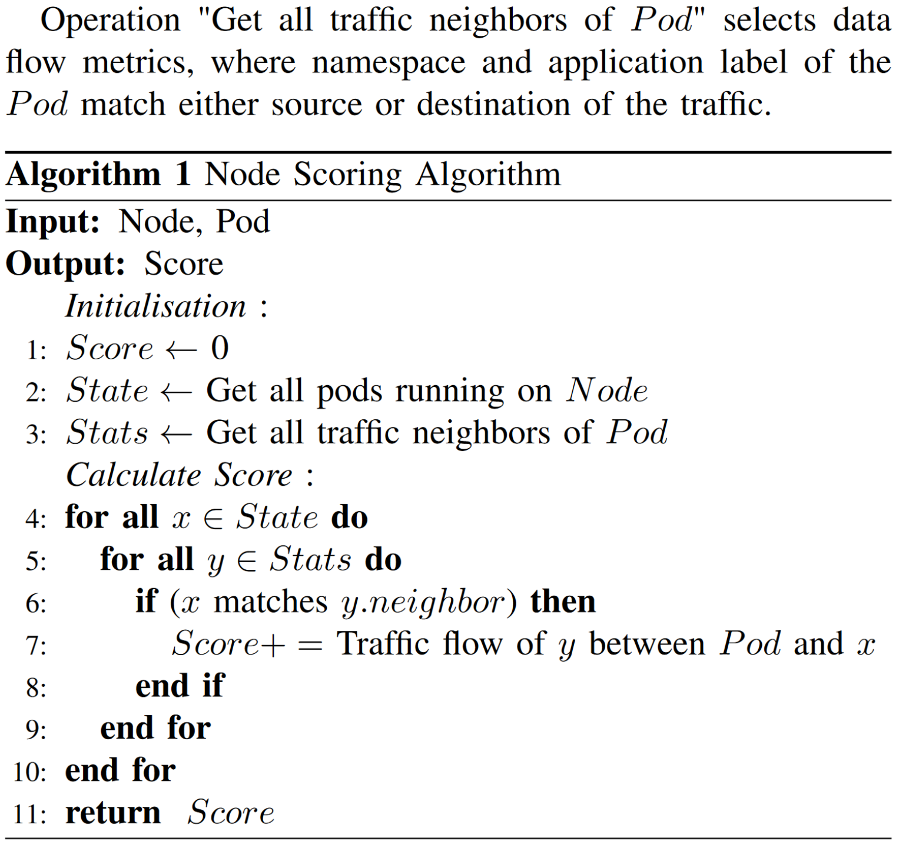
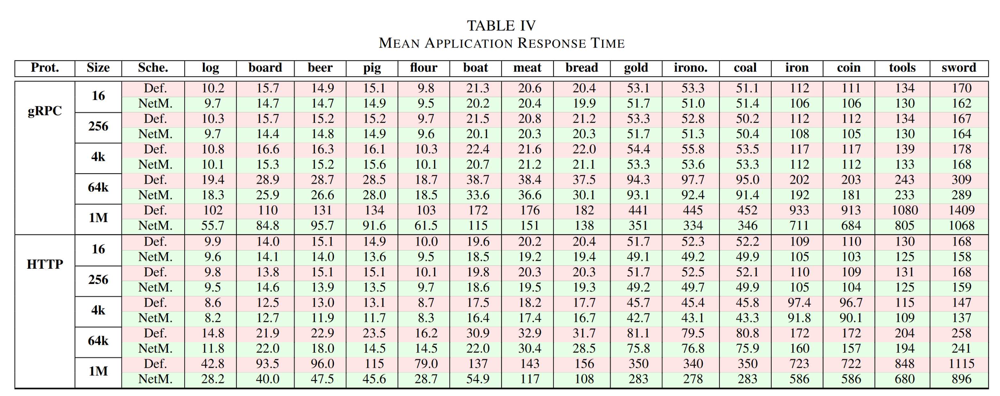
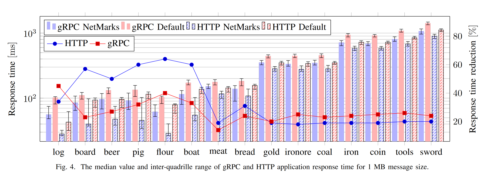
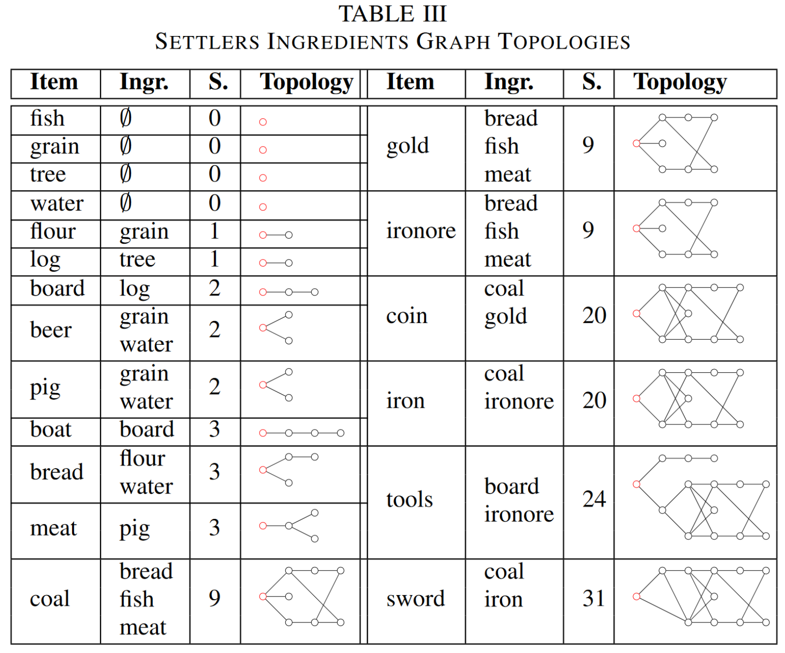
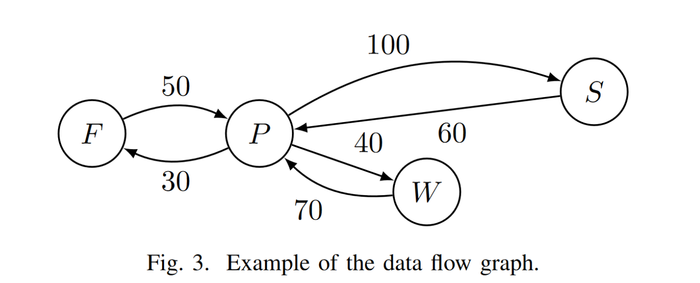

# NetMARKS

>  论文：Network Metrics-AwaRe Kubernetes Scheduler Powered by Service Mesh
>
>  IEEE INFOCOM 2021 - IEEE Conference on Computer Communications

## 文章概述

### 极简摘要

背景：容器为王的当下，当“高吞吐、低时延”的 5G 大大减少容器之间的通信损耗后，容器调度变得极为重要。且 Kubernetes 已经成为容器编排领域事实上的标准。

研究现状：不是完全推翻现有的调度方案，就是只考虑到静态调度。（换言之作者应该就想要基于现有的一些调度方案来一些动态的调度）

解决方案：利用 Istio 服务网格收集到的动态网络指标（metrics）进行调度，并且这种方法是完全向后兼容的。

结果分析：NetMARKS 可以在全自动调度的情况下减少 37% 的应用响应时间和 50% 的节点际带宽。

本文的三点主要贡献：

- 描述 Kubernetes 的调度器和 Istio 服务网格的能力
- 设计并实现 NetMARKS （基于 Istio 收集的数据的 Kubernetes 调度器插件）
- 全面地测试以评估 NetMARKS 的效果

### 工作背景

- 容器很好 用的人很多
- 5G 很快 解决了节点之间的通信问题
- 多路边缘计算

### 相关工作

前人已经做的一些尝试：

- 不考虑网络指标（network metrics），仅仅最小化底层设备的费用
- 利用最小费用最大流算法部分考虑资源限制，但没有考虑内部网络延时
- 根据预期耗时安排算例的调度算法，仅关注计算资源，不考虑网络指标
- 手动给定服务函数链的信息，假定各个节点带宽一致下的启发式调度
- 基于用户手动给定的应用信息，通过整数线性规划进行调度

总结下来其实就是摘要里讲的 “不是完全推翻现有的调度方案，就是只考虑到静态调度”，或者是基于“手动给定的信息”这种实际上并不太能大规模应用的方法。

所有提到的缺点都是 NetMARKS 的优点：

- 继承现有方案：其实是 Kubernetes 的调度器插件
- 动态调度：利用 Istio 收集网络指标动态调度
- 自动调度：这个数据是收集到的不是输入的

### 调度算法

#### 直接动机

- 大量相互通信的 pod 之间的网络时延不可忽视。特别是在 5G 提供了超低延时的无线通信后这个时延变的更为重要。
- 通过 gRPC 和 HTTP 两个种协议进行测试，让两个 pod 在同一个节点可以减少 69%、 66% 的响应延时。
- 手工为调度提供数据显然是不可行的方案

#### 顶层设计

##### 前提条件

- 完全向后兼容 kube-scheduler（通过 Kubernetes Scheduler Extension 机制实现）
- 假定 Istio 在所有命名空间中开启
- 假定 Prometheus 监控系统在 Istio 控制面板中部署

##### 调度依据

 Prometheus 能够提供两个指标： `istio_request_bytes_sum` 与 `istio_response_bytes_sum`。其实可以很显然地看出他们的作用：请求字节数、响应字节数。

假设 $$F_{t_1,t_2}^{A,B}$$ 表示 $$[t_1,t_2]$$ 时间段内从 A 到 B 的平均数据流量，由此定义易得：
$$
F_{t_1,t_2}^{A,B}=\frac{(req_{t_2}^{A,B}-req_{t_1}^{A,B})+(resq_{t_2}^{B,A}-resq_{t_1}^{B,A})}{t_2-t_1}
$$
数据的更新总是在某个时间点“突然更新”的，所以我们可以将它进行适当变形：
$$
F_{t_0,t_{i}}^{A,B}=\frac{F_{t_0,t_{i-1}}^{A,B}(t_{i-1}-t_{0})+F_{t_{i-1},t_{i}}^{A,B}(t_{i}-t_{i-1})}{t_{i}-t_0}
$$
如果用 $$F(t_i)$$ 来简单简化 $$F_{t_0,t_{i}}^{A,B}$$  ，并将最新一段的时间用定义式代入可以得到：
$$
F(t_i)=F(t_{i-1})\frac{(t_{i-1}-t_{0})}{t_{i}-t_{0}}+\frac{(req_{t_i}^{A,B}-req_{t_{i-1}}^{A,B})+(resq_{t_{i}}^{B,A}-resq_{t_{i-1}}^{B,A})}{t_i-t_0}
$$
时间信息总是已知的，而现在 $$(req_{t_i}^{A,B}-req_{t_{i-1}}^{A,B})$$ 和 $$(resq_{t_{i}}^{B,A}-resq_{t_{i-1}}^{B,A})$$ 其实就对应着 Prometheus 所提供两个指标。

##### 评分算法

> 对于 Kubernetes 的调度器来说他的调度方式为：根据插件及权重算出某个节点的分数，再从分数最高的节点中随机选择一个点作为安排 pod 的节点。
>
> 因此对于一个 Kubernetes 调度器插件的实现来说，核心的是评分算法。

别看步骤貌似非常多，但是总结下来就是：

- 输入：Node, Pod
- 输出：该 Node 与指定 Pod 之间所有的直接流量之和计为分数

相当于说，在所有 Node 之中，谁和当前这个 Pod 的“共同语言”越多，那就把 Pod 放进这个 Node 里。使用贪心的方法，尽可能减少跨节点的流量，让 Pod 们尽量在节点内通信。

这个分数用于决定，当前这个 Pod 应该被放置于哪一个 Node 之中。

### 测试环境

#### 环境配置

关注边缘环境：由 3-7 台更小的主机构成一个集群。

分离两种网络：节点内部网络和管理网络

#### 测试应用

应用功能：应用 Settlers 模仿《工人物语2》的物品生产，要生产某个物品的时候主动去请求某一个他依赖的物品，直到依赖的物品齐全了他才生产出来。

流程控制：通过 order application 控制应用发起初始请求，并且他可以去控制每个请求的参数（比如每次生产几个物品，每次发送几个物品等），同时还可以进行计时功能。

协议支持：应用支持测试 HTTP 和 gRPC 两种协议。

应用实现：通过 `GoLang` 编写，后端通过 `goroutine` 来监听请求。为避免干扰，单个 `goroutine` 既处理请求也处理相应。

整个测试应用通过一系列 Pod 部署在集群上，每一个 Pod 运行一个生产特定物品的 Settlers 应用示例，生产相同物品的 Pod 会被聚合成一个 Kubernetes 服务。

### 结果分析

#### 应用响应时间

NetMARKS 需要一些通信的数据才能开始调度，因此在正式开始之前需要进行若干的数据收集。而后对于deployment 随机运行 1000 次，获取其最终的位置信息。作为对比的 kube-scheduler 也是重复这个步骤。

在测试集群当中，每一个节点都认为是完全一致的，有着相同的硬件和软件条件。这使得我们仅需要观察本质不同的部署方案，因此 1000 次部署当中大概只有 120 个。

接下来对每一个不重复 pod 布局都从 16B 到 1MB 这些不同的消息大小进行性能测试。最终统计出每个消息大小下的平均应用响应时间。从数据中可以看出：

- 对于那些复杂的指标，其响应时间大约减少20%。（他们往往共享某一个供应链，很难达到最佳效果）
- 而对于简单的指标来说，能达到的效果就更好了，gRPC 可以减少 40% 的响应时间，HTTP 甚至可以达到 60% 的优化。

#### 节点间数据传输

尽量减少节点间数据传输：显然，节点内部之间的传输带宽肯定是远大于节点之间的传输。而且对于雾计算来说，节点之间的数据传输还会影响设备的使用时间（耗电）。

为评估该指标，对于每个测试数据都统计“请求所需节点间传输数”，取平均作为最终结果。可以看到，默认的调度方案中需要 80% 的节点间传输，而 NetMARKS 可以减少至 35%，甚至对于一些简单的物品仅需要 4% 的节点间传输。 

### 总结

#### 结果总结

本文评估当前 Kubernetes 中包含的调度方案对于延时敏感的工作负载在边缘集群的表现。包括：

- 评估当前调度器的能力及 pod 组合方式（说明这是一个潜在优化空间）
- 即使是少量服务的线性结构，应用响应时间延时也可以减少 30%
- 一种基于 Istio 服务网格的节点调度算法

#### 改进空间

##### 负载均衡

已进行的研究证明我们的调度插件对于 HTTP 和 gRPC 协议下的服务均可用。

但 Kubernetes 的负载均衡机制（轮询），对于每个 service 我们都仅认为他只有一个实例。

实际上在负载均衡过程中可能有一些自定义的需求，后续工作可以从自定拓扑结构的服务的负载均衡入手。

##### 调度顺序

当前的分配算法基于当前集群状态，网络指标和要调度的 pod。尽管这个分配算法在给定时刻是最优的（根据当下的这些数据），但他可能会因为 pod 的调度顺序变为次优。（不同的调度顺序会影响最终的结果） 未来工作我们可以使用人工智能算法调度一个长期最优的 pod 分配方案。

##### 全局最优

局部最优不一定会全局最优。为解决这个问题 Kubernetes 启动了 descheduler 项目将一个可能可以被优化的 pod 踢出来重新调度。通过这种方法，可能可以能达到更好的全局最优效果。

##### 地理分布式

最后可以将这个想法拓展到地理上的分布式集群。服务网格提供的 telemetry 数据能够用来自动发现和监控不同集群之间的延时。这使得应用能被高效地分布在这些集群中。

## 论文总评

### 优点

#### 零基础

从零开始引入，十分友好（虽然这算不算一篇论文的优点？）

更容易让人明白他的背景条件（毕竟这是一个 Kubernetes 的调度器插件），让不怎么懂 Kubernetes 的人也能大致明白他核心想做的内容。

#### 数据呈现

数据表里有详有略，可以很直观的体现出实验结果。

比如表五表示了平均应用响应时间，表格把所有的情况都列举出来，十分的详细，让人可以信服“对于这么多种可能的情况，这个算法都是适用的”。但是作者也考虑到，纯粹数字之间是很难有一个直观的“量”的程度，因此作者特地画了一个图四（1MB 信息大小下的应用响应时间对比）。

对于测试应用的几种制品，一个表格也是呈现地非常优雅。结合拓扑图，可以清晰地表现出他们之间的关系。能够使用有限的篇幅，很好地说明情况。（让人快速把握）

#### 举例恰当

比如在阅读核心算法的时候，第一次读其实没有很读懂他的意思。比如“这个 score 做啥用的”？但是作者在下面马上附带了一个例子，来解释这个算法，一下子就让人明白了他所定义的这个算法的作用。

不过反过来说，这也是前面没有讲的太清楚？（或者只是我功力太浅）

### 缺点

#### 观点分散

虽然说文章分了各个结构，每个结构都有标题，甚至每段话的第一句都是总结。但是，给人一种非常“离散”的感觉，他列了很多点，但是要把这些点串联起来还得靠自己的想象与思考，或者是读到后文才明白。

其实最开始没有很能读懂这篇文章想做什么（特别是没有读完的时候），也是到后面了才一下子串了起来，明白了他的各个部分的含义。所以“分-总”要少用一些，多来点过渡句，或者来个“总-分-总”才方便快速阅读。

（对于一些看起来是上下文的内容，我实在是很难理解“这里为什么就‘所以’”了，或许这个是功力问题吧）

#### 应用场景不清晰

要做节点调度的时候，需要体现意义的话，得关注各个环节的实际用时。

虽然说他对于调度的效率是一种证明，但是总是给人感觉条件很不清晰，会产生“这样很好，可是有必要嘛”这样的疑问。

比如说实验的环节，也并没有更多地展开到底网络环境是如何如何。（不过此处的话是不是只能说明，实验要求的网络环境并没有太高？）

只是还是会怀疑真实的应用场景。

## 衍生思考

### 5G 在文章中的作用

文章中从摘要到介绍大量提及 5G “高吞吐量、低延时” 的特点，以此来强调 “集群内部的调度变得更加重要”。

且不论能否真正发挥 5G 的特性，节点间通信延时越大才越显得调度算法重要吧？如果说节点间传输和节点内传输的代价几乎相当，那就没有区分出这两种不同的概念的必要？如果节点间传输的代价更大，这时候才更需要这样的调度算法来尽量避免节点间数据传输。

从论文的结尾部分我们可以看到，作者在最后提出可以拓展到“地理上的分布式集群”，那说明他还是在本地（至少很近）的机器上若干机器上进行实验（论文中并没有详细说明）。在这种情况下，直接使用有线网络连接岂不更好？

即便按文中所说的 `Kubernetes deployment in telecommunication edge environment`  但也不太理解这个东西和 5G 之间的关联？（感觉场景并不是很统一）

所以这个 5G 是真的很有作用？还是纯纯只是蹭热度的一个噱头罢了。

### Kubernetes 

#### 进阶学习

在阅读论文的过程中，文章所做的事情让我去重新思考 `deployment`、`service`、`pod`、`node` 这些的概念。原本虽然说会最最基本的使用，但仍然停留在表面名词的理解上，并没有真正地去深入了解。

作为容器编排方面“事实上的标准”的 Kubernetes，如果未来继续深耕云相关的领域，对他的了解或许要更加地深入，这时候应该把 TODO 里的《深入剖析 Kubernetes 》提升一下优先级拿起来继续学。

Kubernetes 这个领域是我们应该研究的，但是不太可能所有领域都投入这么多的精力。那在阅读论文的时候，面对那么多的前置知识，要不要去补齐？

目前的看法是：要想未来成为大佬的话，这些“全面”的知识肯定是要学习的。但是倘若现在时间不足的话，就要选择性的分出个先后顺序来学。

#### 论文写作

不过我们也需要注意，写论文就是把对方当“小白”，或许要尽量地从零开始描述概念？（除非说这个是一个行业内特别显然的名词？）

不过对于此处就很有疑惑：为什么这篇文章如此详细地描述了 Kubernetes 里的这些概念，其他文章会这样做吗？到底是面向小白，让小白都能看得懂（虽然很懵）；还是点到为止，让领域内的用户看的明白就好（不过分赘述）？

这可能就需要进一步地阅读才能知道（也可能是“就知道了”）。

### 跨 node 数据传输方案

在实验中使用 Flannel CNI plugin 作为跨 node 数据传输方案。（但是这个只是其中一种）

既然要研究调度的效果是不是应该比选一些其他的方案？（其实也不是很重要）和上一点非常相似，就是需不需要继续去拓展这个方向的问题。

比如说跨 node 数据传输方案还有哪些？比如说 `tun` 他又是如何实现的？`NAT` 能不能应用在这里？

有些方案为什么不行（被淘汰）呢？比如 `VPN` ，又或者 Flannel 的 UDP 模式。

要深入挖掘的话，又是非常庞大的一块待探索领域。

### eBPF

在本文中，对于数据的观测使用的是 Istio 服务网格。但是这种流量的可观测性真的只有服务网格能够实现吗？我们能否通过其他的方式来调度？这时候 eBPF 可能是一个候选项。

> eBPF 能在内核中收集和聚合自定义 metric， 并能从不同数据源来生成可观测数据。

### 论文初印象

这下才明白，为什么一年可能才能出一篇论文了。有时候想着看起来就是有一个还不错的想法，然后把他实现就好，应该花不了那么久吧。但是比选方案实在是太多了，需要思考的时间或许比打一个草稿要多的多。

同样的，一个草稿的算法可能一下子就提出来了。但是如何对他进行实现，通过实验来评估他的效果可能也是比他花更多的时间。（吐槽：这篇论文感觉想法很直接，但是却写成了一篇论文）

可能这就是略读论文可以抓到的精髓：大概记录他的想法与做法。因为不过多扩展的话，确实一篇文章就是一篇文章本身。不过作为一个学习者，或许可以借着“一股劲”好好地补足基础吧……

