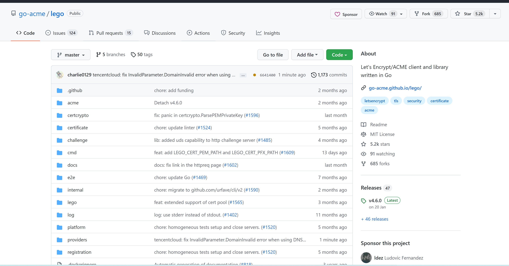

# Traefik in 腾讯云 实现自动签发 HTTPS 证书

## 背景

HTTPS 的优势毋庸置疑，但签发 HTTPS 证书是一件非常麻烦的事情。

> 如果使用腾讯云中最传统的方式应当如何操作？
>
> 简要概括的话就是：
>
> 1. 在控制台中申请一张 TrustAsia 的有效期一年的证书
> 2. 将这张证书的文本信息添加到 DNS 解析中
> 3. 将证书配置到自己的服务器中（比如 Traefik）
>
> 整个过程还是需要一番操作的，且有效期仅为一年：一年之后你得重新做一次

因为上 HTTPS 很麻烦，自然就不想上。那么倘若有一种方法可以一劳永逸地解决这个问题，让你一次配置，幸福一生，那自然是十分愿意尝试的。（特别是舍友已经在阿里云上十分简单的搞定了这件事）

这种解决方案叫做 [`ACME`]('https://datatracker.ietf.org/doc/html/rfc8555') (Automatic Certificate Management Environment)，自动向 [Let’s Encrypt](https://letsencrypt.org/zh-cn/about/) 申请启用 HTTPS（SSL/TLS）所需的数字证书，[工作原理](https://letsencrypt.org/zh-cn/how-it-works/#) 有兴趣者可以自行了解~

如果你直接翻阅 Let's Encrypt 的[快速入门](https://letsencrypt.org/zh-cn/getting-started/)，你可能就会开始下起 Certbot，看着一堆文档可能就很头疼。就算看起了文档，也觉得配置它是一件非常麻烦的事情。

俗话说得好，专用总比通用方便，由于我使用的是 [`Traefik`](https://doc.traefik.io/traefik/) ，有没有更精准、方便地完成任务的方法？那就要看看 Traefik 的文档里是否有相关内容了，答案是肯定的：https://doc.traefik.io/traefik/https/acme/

## 实操

### 概述

开头总是字少，而又重要的。在第一小节 Certificate Resolvers （秉承着非专有名词都要翻译成中文的原则，尝试性翻译为 证书签发器）中，文档告诉我们：

1. 要在 Traefik 的静态配置中定义证书签发器，这些证书签发器会去向 ACME 服务器（在这里其实就是 Let's Encrypt）去请求并签发证书。
2. 每个路由都应该打开 TLS 并通过 `tls.certresolver` 关联到对应的证书签发器
3. 路由的动态配置中检索得到的域名会开始请求签发证书

> 你有没有发现，相比于 Let's Encrypt 官网的说明，在 Traefik 中的配置似乎十分的简单？并没有那么多奇怪的步骤。
>
> 这主要是因为 Traefik 为我们集成了许多操作，比如请求签发证书（有效期90天）、证书续命（提前30天）等操作它都为我们打包好了。所以对我们来说，在 Traefik 中的配置不过是写写配置文件罢了，十分简单。

### 证书签发器

显然最为重要的环节就是定义好这个`证书签发器`，Traefik 为我们提供了 TLS 法、HTTP 法、DNS 法三种方法。从篇幅来看就知道，我们最好使用 DNS 法（`dnsChallenge`）。对于 DNS 法，Traefik 其实是采用了 [`lego`](https://go-acme.github.io/lego/) 这个 ACME 客户端。很**幸运**的是 lego 已经提供了腾讯云的支持，其编码为 `tencentcloud`。

根据[文档]('https://go-acme.github.io/lego/dns/tencentcloud/')，我们需要准备 `TENCENTCLOUD_SECRET_ID` 和 `TENCENTCLOUD_SECRET_KEY` 这两个环境变量。我们在腾讯云的控制台中创建一对密钥，将它复制粘贴保存到本地的环境变量中。如果你是通过 docker 部署的Traefik 的话，仅需要在 docker-compose.yml 中加上：

```yml
environment:
    - TENCENTCLOUD_SECRET_ID=${TENCENTCLOUD_SECRET_ID}
    - TENCENTCLOUD_SECRET_KEY=${TENCENTCLOUD_SECRET_KEY}
```

> 这两个变量是什么？
>
> 其实是申请证书过程中需要在你的 DNS 解析中添加一条记录来验证你的身份，因此需要”登录“你的腾讯云进行操作。但对于 API 来说，登录这件事情必定是用密钥来实现的。因此你需要在腾讯云的控制台中创建一个子用户，把它的 ID 和 KEY 保留下来，供 LEGO 调用。

在静态配置文件中，我们加入：

```yml
certificatesResolvers:
  tencentcloud: # 可以换成你喜欢的名字
    acme:
      email: your-email@example.com # 届时你申请签发证书的邮箱
      storage: acme.json
      dnsChallenge:
        provider: tencentcloud # 腾讯云的编码
        resolvers:
          - "119.29.29.29:53" # 腾讯云的 DNS 地址
```

!> 请务必提前准备好一个 `acme.json` 文件，并保证其权限为 `600` 。

### 路由配置

以官方文档中的样例进行分析：

```yml
## Dynamic configuration
labels:
  - traefik.http.routers.blog.rule=(Host(`example.com`) && Path(`/blog`)) || Host(`blog.example.org`)
  - traefik.http.routers.blog.tls=true
  - traefik.http.routers.blog.tls.certresolver=myresolver
```

文档说，这样配置能够签发 `example.com` 和 `blog.example.org` 两张证书，对比官方的另外一个例子可以知道，其实就是看 `rule` 中有哪些 `Host`，用到哪些域名他就会自动为我们去申请签发相应的证书。

因此，我们实际使用过程中只要记得加上第四、五行就能自动签发 HTTPS 证书啦~

如果想一次性签发更多域名的证书，或者是想签发泛域名的证书应当如何操作？官方文档也给出了例子：

```yaml
## Dynamic configuration
labels:
  - traefik.http.routers.blog.rule=Host(`example.com`) && Path(`/blog`)
  - traefik.http.routers.blog.tls=true
  - traefik.http.routers.blog.tls.certresolver=myresolver
  - traefik.http.routers.blog.tls.domains[0].main=example.org
  - traefik.http.routers.blog.tls.domains[0].sans=*.example.org
```

能有 `domains[0]` 那必然可以有 `domains[1]`、`domains[2]`、`domains[3]` 啦~

如果你不需要泛域名的话，`sans` 字段也是可以省略的。

> 自己的服务器中开了很多服务，已经懒得一个一个去配置了该怎么办？
>
> 直接在控制台对应的路由里申请一张泛域名证书就好了！
>
> 不过需要注意的是，泛域名只支持一级哦~也就是 `*.example.org` 是可行的，`*.*.example.org` 就是非法的。你只能一级一级的申请！

## 挫折

> 太长不看版：
>
> 4.7 版本之前的 lego 不能支持当前的腾讯云，存在有 bug，不过我和舍友 [CC](https://github.com/charlie0129) 已经[修复](https://github.com/go-acme/lego/pull/1616)了它。
>
> 在等待 Traefik 官方更新之前，可以使用我们编译的 docker 镜像 [`frogsoftware/traefik`](https://hub.docker.com/r/frogsoftware/traefik) 。

### 发现

本来这个教程到上方也就结束了，但如果你使用的附带有 Traefik 及以下版本的 lego 的 Traefik ，你就会发现：会报错！

```
[tajuren.cn] [tajuren.cn] acme: error presenting token: tencentcloud: create record failed: [TencentCloudSDKError] Code=InvalidParameter.DomainInvalid, Message=域名不正确，请输入主域名，如 dnspod.cn。
```

??? 这不是一个好好的域名吗？为什么说域名不正确呢？百思不得其解。

最开始我以为是我配置错了，于是拉上我的舍友 [CC](https://github.com/charlie0129)（成功在阿里云上配置的那位）一起研究。当然，在这个过程中，我干了许多原本没打算干的事情：

- 了解 HTTPS 的证书到底是怎么签发的（DNS法）：毕竟报错是创建记录失败
- 知道 Traefik 是用 `lego` 客户端签发的：这才知道调用的是腾讯云的 GO 的 SDK
- 翻阅  [lego 的 GitHub 仓库](https://github.com/go-acme/lego) ：看看别人有没有遇上同样的问题
- ……

折腾了好几个小时，最终还是觉得不是配置的问题。

于是，有没有一种可能，是 lego 出了锅？但毕竟开源项目，之前能用现在为什么突然不能用？不是 lego 出了锅，那就是腾讯云的锅！

通过 [Pull Request 记录](https://github.com/go-acme/lego/pull/1527) 我们可以发现 lego 其实是在2021年12月才开始支持腾讯云，但至少当时还是能够使用的。但是到 2022年2月11日 就已经有用户发表[评论](https://github.com/go-acme/lego/pull/1527#issuecomment-1035876292)，遇到了和我一样的问题。

由于 lego 是根据我们输入的域名，自己去请求回真正要签发的域名的。我们怀疑，是不是 lego 在这个过程中出错了？没有成功请求到域名？或者传递的参数不符合腾讯云的要求？

### 探索

我们没办法肉眼观察得知，所以 CC 就开始编译 lego 源代码，并尝试调用 API 时候的参数。

```go
request.Domain = common.StringPtr(domainData.domain)
request.Subdomain = common.StringPtr(domainData.subDomain)
```


> DEBUG: domainData.Domain: tajuren.cn.
>
> DEBUG: domainData.SubDomain: _acme-challenge

`tajuren.cn.` ?! 我立刻想起腾讯云的 DNS 解析变成 DNSPod 之后，会给域名自动加一个 `.` （最根级的域名），lego 的代码中也确实充斥着 `FDQN` (Fully Qualified Domain Name) 的痕迹。该不会是腾讯云的 SDK 反而不支持 FDQN 吧？

我们进行了编码尝试，改成没有 `.` 的（unFDQN）果然成功了！

把原先代码中的

```go
	return &domainData{
		domain:    zone,
		subDomain: dns01.UnFqdn(strings.TrimSuffix(fqdn, zone)),
	}, nil
```

改为

```go
	return &domainData{
		domain:    dns01.UnFqdn(zone),
		subDomain: dns01.UnFqdn(strings.TrimSuffix(fqdn, zone)),
	}, nil
```

> 果然写代码的时候不能犯懒，subDomain 都需要去掉 `.`(UnFqdn) 才能运行，那 domain 也给加上以防万一嘛hh

虽然不知道到底是哪一方发生了变动导致的不支持，但问题终归是找到了。

### 解决

确认过问题和解决方案之后，我们就得想办法解决，毕竟我们还是要搞 HTTPS 的嘛。

我们将这个修复的代码发起 [Pull Request](https://github.com/go-acme/lego/pull/1616)，并成功被接受，将被集成至 lego v4.7。喜提 5.2k Star 项目的贡献者！（虽然用的是 CC 的号）



但是 lego 的 4.7 版本什么时候发布？不知道。发布以后 Traefik 什么时候集成？不知道。

但是在官方解决之前，仍然有这样一个需求呀！

那我们就自己先编译一个 Traefik 用用！在经历过磁盘空间不足、内存不足和漫长的等待之后，自制版 Traefik 终于上线了！并且我们也已经把它推送到 docker hub 上。

```
docker pull frogsoftware/traefik
```

在 docker-compose.yml 中，把原先的 `traefik` 或者 `traefik/traefik` 换成 `frogsoftware/traefik` 即可。

至此，我们的 tajuren.cn 就快乐的拥有了 HTTPS 证书啦！

感谢在此过程中舍友 [CC](https://github.com/charlie0129) 的大力支持！（哪怕其实因为疫情仍旧各自家里蹲）
