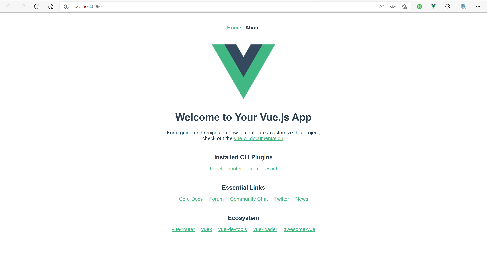

# Vue - `Vue.js` 的基本使用

> 在预备节中我们已经完成 `Vue-Cli` 的安装，接下来我们通过这个工具创建最基本的 Vue 框架，同时尝试练习 Vue 的一些基本特性。

## 创建

### 基本版
首先我们打开终端，执行
```
vue create [demo]
```

这个工具甚至十分贴心的提醒/帮助我们换源，自然是选择 `Y` 啦（或者直接回车）
```
?  Your connection to the default yarn registry seems to be slow.
   Use https://registry.npmmirror.com for faster installation? (Y/n) 
```

只是基本的使用的话，我们可以先选择第二项体验一下。

（不过一般来说，由于大多项目都会使用`Vue Router`，`Vuex`等插件，所以建议参考目录下一节的内容）
```
Vue CLI v5.0.4
? Please pick a preset: 
  Default ([Vue 3] babel, eslint) 
> Default ([Vue 2] babel, eslint) 
  Manually select features 
```

关于 `Yarn` 和 `NPM` 的区别，在预备节已经说明，我们推荐使用 `Yarn`

```
Vue CLI v5.0.4
? Please pick a preset: Default ([Vue 2] babel, eslint)
? Pick the package manager to use when installing dependencies: (Use arrow keys)
> Use Yarn 
  Use NPM 
```

很快的，我们创建了这样一个项目
```
🎉  Successfully created project [demo].
👉  Get started with the following commands:

 $ cd [demo]
 $ yarn serve
```


### 小白推荐版
首先仍然是打开终端，执行
```
vue create [demo]
```
只不过这次我们选择第三项，因为这样可以直接置入 `Vue Router` 和 `Vuex` 这些我们想要的插件。
```
? Please pick a preset: 
  Default ([Vue 3] babel, eslint) 
  Default ([Vue 2] babel, eslint) 
> Manually select features 
```


随后我们可以看到有很多的选项会让我们选择，其中已经 `Vue-Cli`  已经默认为我们选择了 `Babel` 和 `Linter / Formatter` 这两个选项。在这里推荐再勾选上 `Router`和 `Vuex` 这两个选项。

如果你更多的是为了学习、临时测试，也可以考虑关闭 `Linter / Formatter` 这个选项，因为它会使得代码必须严格符合规范之后才能编译运行。（强制你保持良好的编码习惯，虽然也可以通过安装编辑器的插件，开启自动修复来一键格式化）（如果没有自动修复的话，或许你会被烦死）

> 可能好奇的你想要了解各个选项他到底起到什么作用？作为入门教程就简单提一下相关内容
>
> - Babel ：将比较新的 JavaScript 语法转换成兼容 ES5 的语法（让更多浏览器能够运行）
> - TypeScript ：可以认为说是一种支持类型推导的 JavaScript，让代码更为严谨可靠
> - Progressive Web App：渐进式网页应用，粗暴理解就是浏览器里跑应用软件，具体可百度
> - Router ：多页面路由，具体内容后续介绍，几乎必备
> - Vuex ：变量仓库，使得页面之间也能传输变量，几乎必备
> - CSS Pre-processors：预处理 CSS 中的变量，使得 CSS 中支持变量（可以搞骚操作）
> - Linter / Formatter：代码格式化工具，强制让你的代码符合某种标准，否则报 Error
> - Unit Testing：单元测试工具（不过入门时很少关注测试）
> - E2E Testing：端到端测试工具（不过入门时很少关注测试）

```
? Check the features needed for your project: (Press <space> to select, <a> to toggle
 all, <i> to invert selection, and <enter> to proceed)
 (*) Babel
 ( ) TypeScript
 ( ) Progressive Web App (PWA) Support
 (*) Router
>(*) Vuex
 ( ) CSS Pre-processors
 (*) Linter / Formatter
 ( ) Unit Testing
 ( ) E2E Testing
```
随后选择 `Vue.js` 的版本，这里我们选择 `2.x` （毕竟是个 Vue 2 的教程）
```
? Choose a version of Vue.js that you want to start the project with 
  3.x 
> 2.x 
```
因为我们选择了 `Router` 这时候 `Vue-Cli` 就询问我们是否使用历史模式？（如果不使用的话就是哈希模式），根据需求来做出选择（虽然他推荐的是 `Y`）
>什么是历史模式？什么是哈希模式？具体内容我们在后面的课程展开，在这里我们先从效果上分析：
>
>历史模式的路由：www.your-website.com/sub
>
>哈希模式的路由：www.your-website.com/sub/#/
>
>你会发现哈希模式会多出一个丑丑的 `#` ，而且没加好的话甚至会错误的访问路由，所以默认推荐历史模式。但历史模式也有缺陷，真正部署时需要稍微配置一下后端，不过学习过程中可能暂时不用关心这点。
```
? Use history mode for router? (Requires proper server setup for index fallback in production) (Y/n) 
```

由于之前我们选中了 `Linter / Formatter` ，随后他让我们选择到底想要保持什么风格？这里就是不同人的口味问题了，具体四种风格可以参考链接：

- [ESLint 推荐格式](https://eslint.bootcss.com/docs/rules/)

- [爱彼迎风格](https://github.com/airbnb/javascript)

- [JavaScript 标准风格](https://github.com/standard/standard/blob/master/docs/RULES-zhcn.md#javascript-standard-style)

- [Prettier 格式](https://github.com/prettier/eslint-config-prettier)

这里随缘选了一个爱彼迎风格，选什么并不影响后续的使用（前提是不要被 ESlint 折磨到 hh）
```
? Pick a linter / formatter config: 
  ESLint with error prevention only 
> ESLint + Airbnb config 
  ESLint + Standard config 
  ESLint + Prettier 
```

紧接着需要设置附加的 Lint 特性，比如：什么时候应该检查代码？可以根据自己的喜好在每次保存和每次提交的时候进行选择。
```
? Pick additional lint features: (Press <space> to select, <a> to toggle all, <i> to 
invert selection, and <enter> to proceed)
>(*) Lint on save
 ( ) Lint and fix on commit
```
接下来询问我们应该将这些插件的配置文件放在独立的文件里还是合体的 package.json 里。

我建议放在独立的配置文件里，因为这样可以更好的复制粘贴网上的内容x
（还是看各人的使用习惯啦）
```
? Where do you prefer placing config for Babel, ESLint, etc.? (Use arrow keys)
> In dedicated config files 
  In package.json 
```
最后他问是否要把上述设置保存为一个预设模板，便于后续继续创建项目？这个就看你的需求了。
```
Vue CLI v5.0.4
? Please pick a preset: Manually select features
? Check the features needed for your project: Babel, Router, Vuex, Linter
? Choose a version of Vue.js that you want to start the project with 2.x
? Use history mode for router? (Requires proper server setup for index fallback in production) Yes
? Pick a linter / formatter config: Airbnb
? Pick additional lint features: Lint on save
? Where do you prefer placing config for Babel, ESLint, etc.? In dedicated config files
? Save this as a preset for future projects? (y/N) 
```
同样的，我们成功创建了这样一个项目
```
🎉  Successfully created project [demo].
👉  Get started with the following commands:

 $ cd [demo]
 $ yarn serve
```
## 初探
### 启动服务

按照上方提示的命令执行，我们成功编译出并运行了最基本的 Vue 框架

```
 DONE  Compiled successfully in 4307ms    


  App running at:
  - Local:   http://localhost:8080/ 
  - Network: http://你的内网IP:8080/

  Note that the development build is not optimized.
  To create a production build, run yarn build.
```
访问相应的链接，我们可以看到这个初始框架的模样了。



> 眼尖的人可能看到在浏览器的工具栏中也出现了一个 Vue.js 的 LOGO, 但在自己的浏览器中却没有发现？那么这是什么东西呢？
>
> 这其实是浏览器插件 `Vue.js devtools` 可以让我们在开发过程中查看相关页面的变量情况等等
>
> （而且这个 LOGO 只有在遇到 Vue.js 编写的网页时才会亮起来，可以借此看看各个网页到底是不是用 Vue 写的哦）

### 认识目录

我们也可以观察一下创建出的目录文件夹，看起来还是很复杂的（特别是使用小白推荐版的）

> 为什么有小白推荐版？
>
> 如果你愿意对比这两种不同方式安装的源代码，你就可以看到有许多额外的配置文件和目录结构。如果使用基础版创建框架，而后续又需要用到 `Router` 和 `Vuex` 的话，这些就需要自己文件手动添加、修改了。

外围的各个配置文件我们可以暂时不去管，直接查看 `src` 文件夹下的内容

- `main.js`：一切的开始，程序的入口。（短期内不会去修改他）
- `App.vue`：网页的入口，意味着你看到的所有的网页都是在这个页面的基础上进一步细化。（ `.vue` 是 Vue 相关文件的后缀名）
- `components`：组件，类似于网页版的“子函数”/“子过程”，我们根据需要自定义的各种组件应当放在该文件夹下。
- `views`：视图，特殊的一类组件。特殊之处在于，每个视图原则上应该对应至少一个路由。
- `router`：路由，其中只有一个 `index.js` ，用来设置我们所需要的路由信息。初步阅读之后可以猜想：`/` 路由对应的是  `HomeView` 视图，`/about` 路由对应的是 `AboutView` 视图。在 `http://localhost:8080/` 中我们也可以发现这一点。
- `store`：`Vuex` 所创建的用来存放数据的 “公共仓库”，供各个页面来共同使用，同样只有一个 `index.js` 。（潜含义：各个组件创建的变量只有本组件能够使用）
- `assets`：可以理解为资源文件，网站中需要用到的图片、音频等资源都应当放在该文件夹下。

### 认识 `App.vue`

#### template

```vue
<template>
  <div id="app">
    <nav>
      <router-link to="/">Home</router-link> 
      <router-link to="/about">About</router-link>
    </nav>
    <router-view/>
  </div>
</template>
```

`template` 部分包裹起来的，就是网页中我们能够看到的部分。

在 Vue 2 中，做出了这样的限定：每个 `template` 必须是单根的。这也意味着每个 `template` 只能有一个“儿子”，所以你会看到一个“多余”的 `div` 。（在 Vue 3 中已经取消了这样的限定）

对比我们看到的页面，不难猜想： `nav` 应当是 `navigation` 导航的缩写，而导航内有两个 `router-link` 标签分别跳到不同的页面。而 ` router-view` 则根据当前路由自动显示对应的视图。（此部分内容后续具体展开）

#### style

`style` 部分包裹起来的，是当前页面所用到的 CSS 类。

对于没有美工基础的小白来说，这个部分往往不会去过多折腾，放空或删掉就行。

当然，如果你已经学会了 CSS ，自然就可以灵活的运用起来

### 认识 script

#### script 是什么？

> 其他资料都说 Vue 由三个部分组成，但是 `App.vue` 貌似没有 `script` 部分？
>
> 确实没有，但是这不妨碍 `script` 是 非常重要且核心的一部分。

我们以 `HomeView.vue` 中的 `script` 为例进行分析：

```javascript
// @ is an alias to /src
import HelloWorld from '@/components/HelloWorld.vue';

export default {
  name: 'HomeView',
  components: {
    HelloWorld,
  },
};
```

> 注释里虽然写着“@ is an alias to /src”，但我们还是尽量使用相对路径的方式来引用而非 `@`，因为这是 Vue 2 的打包工具 `webpack` 自己的标准，不利于编辑器进行重构、智能补全等。

其实可以看到，在这个部分完全就是在写 `JavaScript`。

> 可是我完全没有学 JavaScript 怎么办？
>
> 没关系，遇到什么写什么，慢慢就在百度中学会了。

上述这个代码的主要功能是，从 `HelloWorld.vue` 中引入 `HelloWorld`  组件并作为子组件引用，同时告知别人：这个组件的名字是 `HomeView` 。

不难猜想核心的部分应该就是

```javascript
export default {}
```

将某个对象暴露出去（目的是便于其他组件的调用）

#### script 怎么用?

最核心、常用的字段应当有：

- `name`：这个组件的名字，对应一个字符串
- `data`：存储变量的地方！
- `methods`：存储函数的地方！
- `computed`：计算属性，后续展开。大致作用是根据其他变量的值算出另一个字段。例：根据 `姓` 和 `名`算出 `姓名`。也可以在 `姓名` 字段被赋值的时候自动调整  `姓` 和 `名`。
- `watch`：侦听器，后续展开。大致作用是当一个变量的值发生改变的时候调用，例如：执行 `余额 = 余额 - 100` 的时候，判断他的新值是否为负数并进行若干后续操作。

我们拿 `AboutView.vue` 进行一点小实验吧。

```javascript
export default {
  name: 'AboutView',
  data() {
    return {
      a: 0,
      b: 0,
      c: 0,
    };
  },
  methods: {
    sum1(a, b) {
      return a + b;
    },
    sum2() {
      return this.a + this.b;
    },
  },
};
```

> `data`  为什么长哪样？新手期可以不用去管他，只知道在 `return` 的那个对象里写上就行了

这是一个经典的 `A+B` 问题。

能否猜想出 `sum1` 和  `sum2` 之间的区别？

`sum1` 需要传入两个参数，返回的是这两个参数的和

`sum2` 则是直接调用 变量 `a` 和 变量 `b` 。（想要调用定义好的变量就必须要用 `this.`前缀）

> 其实这里就可以猜想：`data` 里返回的内容会变成 `this` 的一部分。
>
> 其实不光 `data` ，脚本部分的所有模块其实都是如此。

## 应用

> 我们已经初步了解了 Vue 框架的各个部分，但是看了这么久，会发现我们还是没办法写出什么代码？
>
> 比如上方就算写了脚本，但是貌似没有地方能够使用？（没有地方能够输入、输出、掉用）

我们回忆一下 `Vue.js` 这个框架是用来做什么的？是为了方便我们写前端的。

自然我们最终应当回归到前端，或者说 `HTML` 身上。只是在 Vue 里，结合了其他特性的 `HTML` 被放入了 `template` 里。我们简要学习一下 `template` 里最常用的几点，也可以参考[官方文档-模板语法](https://cn.vuejs.org/v2/guide/syntax.html)

注意：在 `template` 里使用变量、函数等脚本里的内容，不需要添加 `this.`

> 是不是觉得很乱？一会要添加 `this.` ，一会不要添加的。
>
> 其实是很一致的：脚本里要添加，模板里不要添加。
>
> 拓展：Vue 3，或者说 组合式 API，就统一起来：全都不需要。

### 显示变量

```
{{ 一个表达式 }}
```

比如我们可以这样写：

```vue
<p>1+1={{ 1 + 1 }}</p>
<p>{{ a }}+{{ b }}={{ sum1(a, b) }}</p>
<p>{{ a }}+{{ b }}={{ sum2() }}</p>
```

### v-on

`v-on:`，也可以缩写为 `@`，主要作用是绑定对应的事件。
常用的事件有 `click` 点击事件， `change` 变更事件等等。
比如我们可以让开关的点击事件绑定上 `a+=1`，达成给a加1的效果

```vue
<button v-on:click="a += 1">给a加1</button>
<button @click="b += 1">给b加1</button>
```

### v-bind

`v-bind:`，也可以直接缩写为`:`，主要作用是单向传值。原本的各个属性"="之后，双引号里的内容一律按字符串处理，但是用上了 `v-bind:` 之后，就可以当一个表达式来看待了

```vue
<button @click="a += 5" v-bind:disabled="a > 10">
 给a加5，但大于10以后禁止
</button>
<button @click="b += 5" :disabled="b > 10">给b加5，但大于10以后禁止</button>
<input :value="a" />
```

值得注意的是：`v-bind` 属于单向传递，输入框里显示的是最新的 `a` 的值，但是修改输入框却不能修改 `a` 的值。

### v-model

既然有单向传递的 `v-bind`，那必然应当有双向传递的语法，那就是 `v-model`。

```vue
<input v-model="b" />
```

不过你会发现用起来的效果似乎并不符合预期？

其实是涉及到类型问题，直接 `v-model` 一个输入框的值得到的是字符串类型的结果。

因此可以结合计算属性，侦听器等方式进行额外的一些操作。

### 计算属性 computed

在上方的例子中，我们可以发现直接让 b 和文本框进行双向绑定是有缺陷的：新的 b 是字符串类型而非数值类型。这样会对我们后续的处理增加很多不便，很自然的我们就联想到 `getter` 和 `setter` 。在 Vue 中我们通过计算属性来实现：

```javascript
computed: {
  bb: {
    get() {
      return this.b;
    },
    set(value) {
      this.b = +value; // 将 value 转化为数值类型
    },
  },
},
```

在一些情况下，我们可能只用到了 `getter` ，这个时候就可以利用 Vue 提供的小小语法糖来偷点懒：

```
computed: {
  bb() {
    return this.b;
  },
},
```

> 此外 `计算属性` 这样一个名字也意味着它应当还有别的特性：缓存。也就是：算过一次的内容不会计算第二次，这可以有效提升运行速度（？），可以参考[官方例子](https://cn.vuejs.org/v2/guide/computed.html#%E8%AE%A1%E7%AE%97%E5%B1%9E%E6%80%A7%E7%BC%93%E5%AD%98-vs-%E6%96%B9%E6%B3%95)

### 侦听器 watch

然而有时候计算属性也不足以满足需求，我们希望监听某个属性的变化，使得它支持更多我们想要的操作。

下方的例子仅提供了一个参数 `newValue`，实际上你可以使用可选的第二个参数 `oldValue`。

```javascript
watch: {
  aa(value) {
    this.a = +value;
  },
},
```

> 你会发现上面这个例子只实现了 `aa`  变化的时候  `a` 跟着变，但反过来不行。[更多例子](https://cn.vuejs.org/v2/guide/computed.html#%E8%AE%A1%E7%AE%97%E5%B1%9E%E6%80%A7-vs-%E4%BE%A6%E5%90%AC%E5%B1%9E%E6%80%A7)
>
> 结合一些其他的原因，我们可以得出结论：能用计算属性完成的时候，尽量使用计算属性哦~ 

## 渲染

对于 `Vue` 来说，还有一个很重要的特性就是根据变量来渲染，或许这就是框架的魅力所在？

我们可以通过各种变量变化，来让显示的内容发生对应的变化，也可以根据显示的内容来调整框架。

[官方文档-条件渲染](https://cn.vuejs.org/v2/guide/conditional.html)

[官方文档-列表渲染](https://cn.vuejs.org/v2/guide/list.html)

### v-if

> 看到 `v-if` 的时候，基因动起来了：`v-else` 、`v-else-if` 是不是也应该存在？
>
> 是的！而且就是你想象的那个用法

```vue
<div v-if="a > b">a&gt;b</div>
<div v-else-if="a === b">a=b</div>
<div v-else>a&lt;b</div>
```

> 道理我都懂，但是 `&gt;` `&lt;` 是个什么东西？
>
> 你看，写 HTML 的时候我们会用 `<` 和 `>` 包起来，那你咋区分 `<br/>` 还是”小于 `b` “呢？
>
> 所以对于特殊的符号需要转义，还有一些很常用的：空格 `&nbsp;` ……

### v-show

`v-show` 的作用是：满足条件时显示这个元素。

看起来似乎和 `v-if` 的功能一样？那为什么要区分出来呢？

简要说一下 [`v-if` 和 `v-show` 之间的差别](https://cn.vuejs.org/v2/guide/conditional.html#v-if-vs-v-show)：

`v-if` 是每次满足条件了才渲染并显示

`v-show` 是一直渲染着，根据需要来显示

> 理论上有效率上的差别，但对于我们新手来说：就那样吧！能选优的更好。

### v-for

都能有 `v-if` 了，怎么会没有我们 `v-for` 呢？

作为一门"10后"的语言，for，当然得是循环for

```vue
<div v-for="(item, index) in items" :key="index">
  {{ item }}
</div>
```

需要注意的是：

- 第二个参数 `index` 并不是必须的，而是可选的。
- 第二个参数可以认为是一种抽象的”下标“，在数组中表现为下标，在对象中表现为属性名。
- 对于 `v-for` 的元素列表来说， `key` 属性是必要且唯一的，它用来区分不同的元素的（自然） 

## 生命周期

Vue 的 `生命周期` 讲述的是一个 Vue 组件在浏览器中从出生到死亡的全过程，具体的流程如下图所示。

其实我们看生命周期有很多，但在初期来说主要使用的就是 `created` 这个阶段。(其实 `beforeMounted`  也可以)

> 我们一般想要实现的都是：点开这个页面就看到数据已经加载好了。
>
> 因此在页面已经创建到展示（挂载）之前，我们应当把数据处理好，所以一般都会使用 `created` 和 `beforeMounted` 这两个生命周期。
>
> 但这两个生命周期肯定还是有区别的，简单说：Vue 是会偷懒的，已经创建好的组件会选择丢在旁边，过段时间再拿出来用，而不是用完就删除下次再创建。

```javascript
export default {
  created() {
    // 做点组件创建以后该做的事情
  },
};
```


